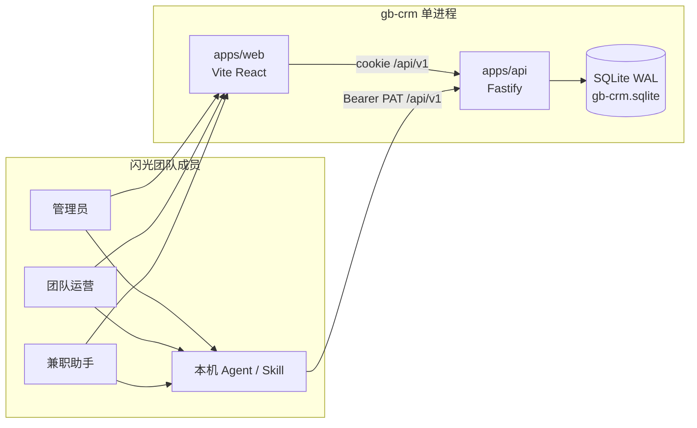
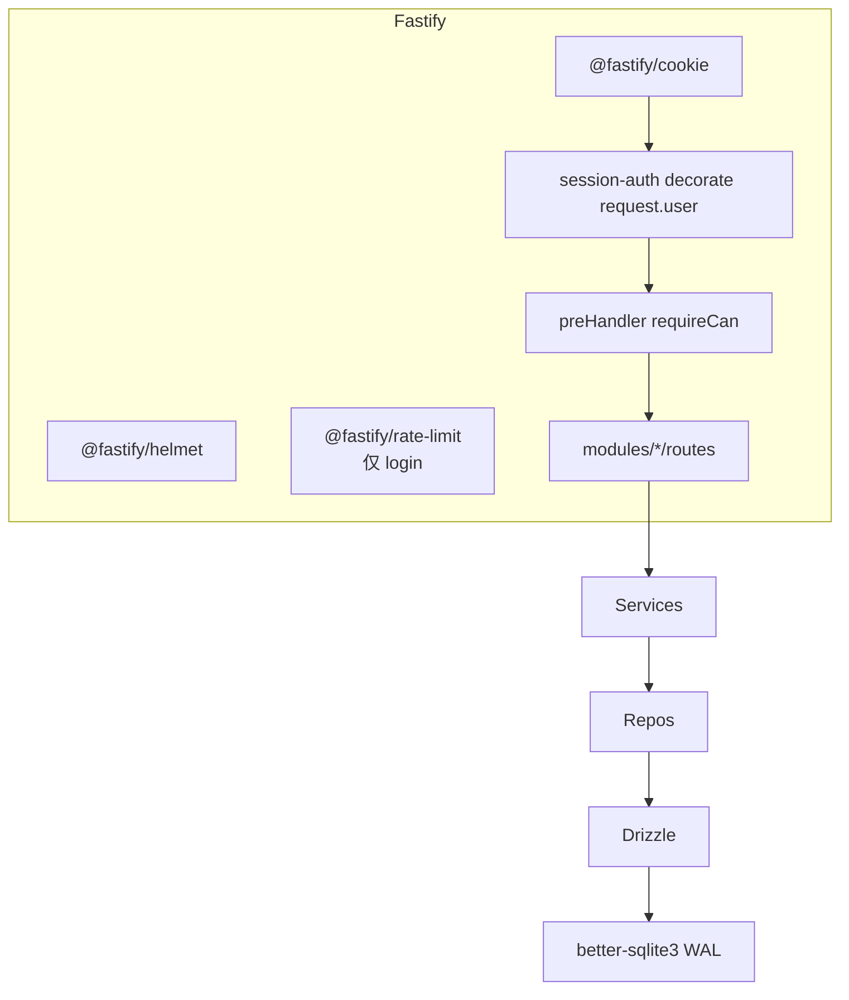
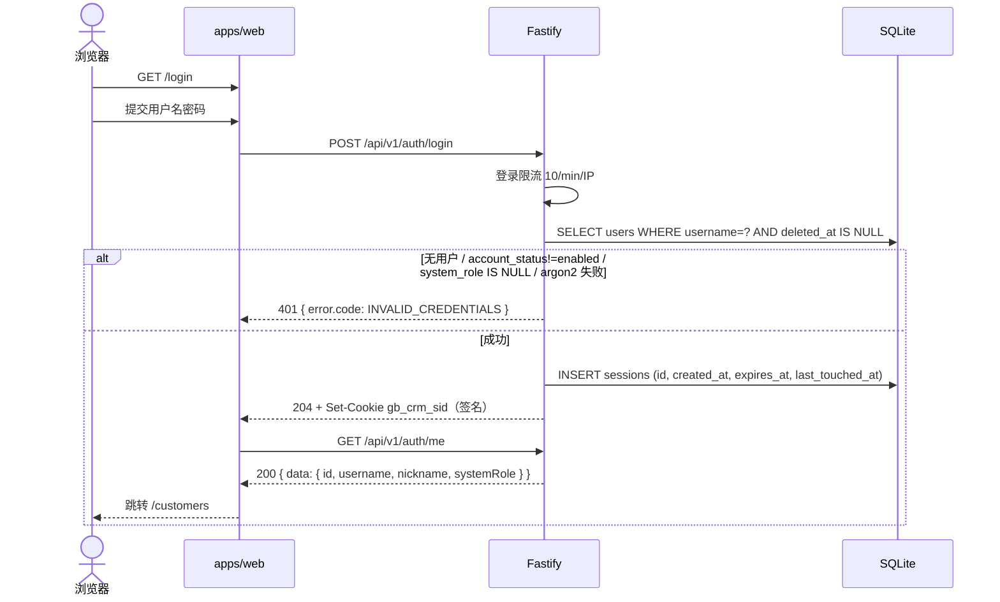
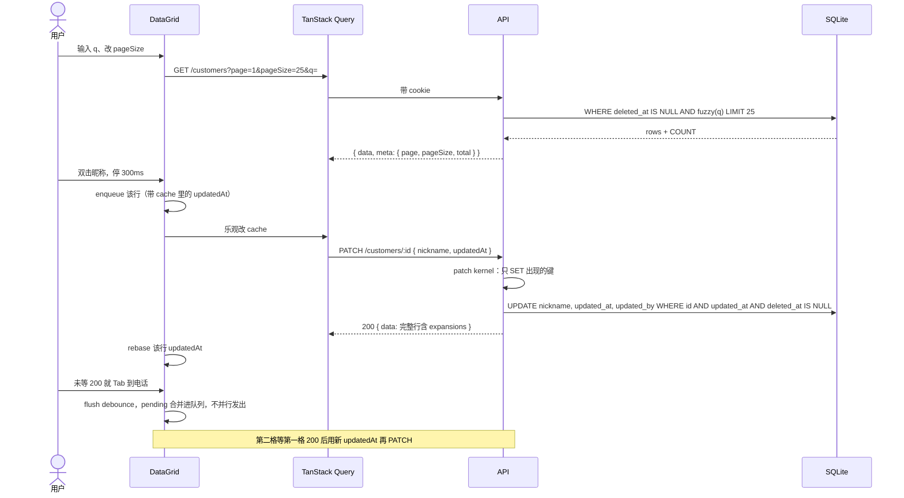
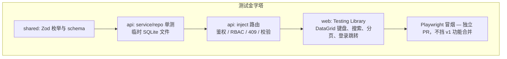
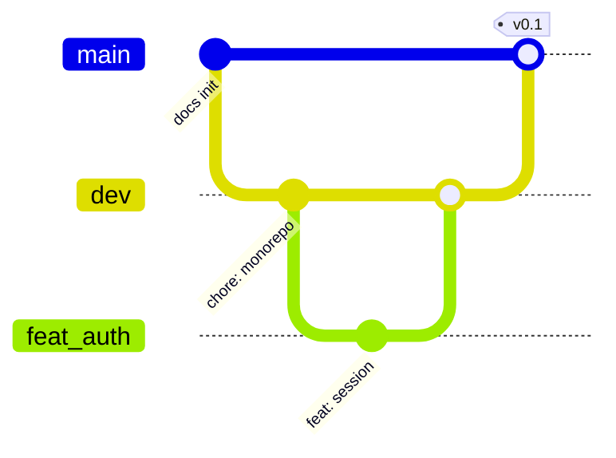
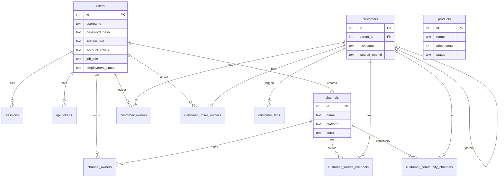

# gb-crm v1 工程架构与实现设计

| 字段 | 值 |
| --- | --- |
| 文档标题 | 闪光团队客户信息管理系统（gb-crm）v1 架构设计 |
| 作者 | Engineering（待署名） |
| 日期 | 2026-08-21 |
| 状态 | Accepted |
| 仓库 | https://github.com/TheSecondCurve/gb-crm |
| 受众 | 闪光团队工程师 / 后续实现 PR 作者 |

---

## Overview

闪光团队目前用飞书多维表格「团队核心数据库」维护客户、渠道、产品和成员信息。该 Base 已有约 393 条客户、64 条渠道、24 条产品、16 名成员，但缺少真正的登录权限、审计字段、Excel 式就地编辑，以及后续运营流程（成交 / 跟进 / 权益）的落地点。`docs/core.md` 要求建立「客户信息管理系统和运营流程系统」；本设计把 **v1 收窄为四张主数据的权限化 CRUD**，运营流程表明确放到 Phase 2。

本仓库目前几乎是空的。2026-08-21 实测：`HEAD -> main`，`main` / `origin/main` / `dev` / `origin/dev` 同停在 `df6b542 docs: initial project documentation`。**不要创建 `dev`**，它已在。该 commit 里 `docs/core.md` 与 `docs/style.md` 是 0 字节空 blob（`e69de29`）；真实需求与 `docs/dev.md`、`example/example_page.html.mhtml` 只存在于工作区、尚未进 git。v1 以 **npm workspaces + TypeScript monorepo** 从零搭建：`apps/web`（Vite + React）复用女商运营管理端已验证的视觉系统；`apps/api`（Fastify + Drizzle + SQLite）提供 REST；`packages/shared` 共享 Zod / ACL / label。认证用 **签名** httpOnly session cookie；表格用 TanStack Table **双击** 单元格编辑 + **行内 PATCH 队列**。规模按飞书摘录实数设计（数百行、十余人），单进程同步 SQLite 足够，不做微服务、Redis 或云厂商绑定。

---

## Background & Motivation

### 当前状态

| 来源 | 现状 |
| --- | --- |
| 飞书 Base「团队核心数据库」 | wiki 私有，本环境未复核。table id / 记录数 / base token 来自父对话摘录，**不是已提交仓库里的契约**。`docs/core.md`（工作区）只在 URL query 里出现渠道 `tblx3PGzNONP3Ugk`、产品 `tblljYU2iuLOOb5F`、客户 `tblvKLGIHObVQ3dV` 三张表。成员表 id 与 base token **不在 git 对象中**。 |
| 仓库 `/Users/xiaowenz/Development/gb-crm` | `git ls-tree HEAD` = 空的 `docs/core.md` + `docs/style.md`（0 字节）。工作区：core/style 有内容（未 staged）、`docs/dev.md` 与 `example/` 未跟踪。 |
| Git | `HEAD -> main`（不是 `dev`）。`origin/dev` **已存在** 且与 `main` 同 SHA `df6b542`。不要再 `git branch dev`。 |
| 女商 · 运营管理端 | `https://gb-dev.localhosts.vip/admin/wechat-users`，布局与 CSS token 已在未跟踪的 `example/example_page.html.mhtml` 固化；业务是微信用户 / 积分 / 会员，**不是本 CRM**。快照是 **行点击** 三列表，不是单元格编辑器。 |

飞书四张 v1 表与记录数（父对话 2026-08-21 查询摘录，**未在本环境对 live Base 复核**）：

| 飞书表 | table_id | 记录数 | 本系统实体 |
| --- | --- | --- | --- |
| 团队成员 | `tbl7HlE2tDnNCbwC` | 16 | `users` |
| 渠道资产 | `tblx3PGzNONP3Ugk` | 64 | `channels` |
| 产品目录 | `tblljYU2iuLOOb5F` | 24 | `products` |
| 客户名单 | `tblvKLGIHObVQ3dV` | 393 | `customers` |

Phase 2 表（本设计不建表、不导入）：成交表 176、用户权益明细 526、活动交付 12、内容资产 56、客户跟进 0、团队调休流水 48。

### 痛点

1. **权限与审计缺失**：飞书表对全员可见可改，无法区分「管理员 / 团队运营 / 兼职助手」，也无法留下创建人 / 最后修改人。
2. **登录身份与业务身份混在一起**：`docs/core.md` 要的是系统角色（管理员 / 团队运营 / 兼职助手）和账户状态（有效 / 失效）；飞书要的是岗位（IP / 运营 / 助理…）和雇佣状态（在职 / 交接中 / 已离职）。不能二选一，必须拆字段。
3. **编辑体验**：主数据维护应当「像 Excel 一样直接改」，而不是每行进表单。飞书接近这个体验，自建系统若退回「点开 Modal 再保存」，迁移动力不足。
4. **后续系统耦合**：客户要预留 `wechat_openid` 以接小程序；渠道 / 客户 / 成员的多对多关系要先落对，Phase 2 的成交与跟进才接得上。

### 产品冲突（必须显式处理，不可静默选择）

`docs/core.md` 的「团队成员 / 本项目用户」与飞书「团队成员」字段不一致：

| 维度 | docs/core.md | 飞书「团队成员」 | v1 建议 |
| --- | --- | --- | --- |
| 角色 | 管理员 / 团队运营 / 兼职助手 | IP / 合伙人 / 运营 / 助理 / 内容 / 其他 / 兼职小助手 / 实习生 | **拆成两个字段** |
| 状态 | 失效 / 有效 | 在职 / 交接中 / 已离职 | **拆成两个字段** |
| 账户 | 账户名 + 密码 | 无（只有飞书用户） | 登录字段可空；无用户名则不能登录 |
| 其它 | 备注 | 职责描述、其他备注、调休余额、飞书用户、若干 link | 调休余额忽略；职责描述保留；link 见数据模型 |

推荐映射：

- `job_title`：飞书业务角色（运营身份，展示用）
- `system_role`：`admin` / `operator` / `assistant`（登录权限；**列可空**，但登录要求非空）
- `employment_status`：`employed` / `handing_over` / `left`（不单独拦截登录）
- `account_status`：`enabled` / `disabled`（登录闸门之一）
- 无登录需求的成员（IP、实习生）**仍写入 `users`**，`username` / `password_hash` / `system_role` 为 NULL，`account_status=disabled`，否则渠道负责人与客户归属人无法 FK。
- 导入时 `employment_status=left` 的行同时把 `account_status` 置 `disabled`；之后两字段独立，在职停用账号被允许。

---

## Goals & Non-Goals

### Goals（v1）

- 独立部署的管理端，中文 UI，视觉语言与女商运营管理端一致（冷灰底 + 玄黑侧栏 + 冷漆红点睛）。
- 登录会话、bootstrap 管理员、按 `system_role` 的 RBAC。
- 四张主数据的分页列表、模糊搜索、单元格就地编辑、软删除。
- 每张业务表具备 `created_at` / `updated_at` / `created_by` / `updated_by`。
- 保留 `feishu_record_id`（历史列，v1 不做飞书导入）。
- 客户表预留可空唯一 `wechat_openid`。
- 工程：npm workspaces monorepo、TypeScript strict、TDD。`apps/api` 覆盖率门禁覆盖 `src/modules/**`、`src/plugins/**`、`src/lib/**`、`src/db/**`，合计 ≥ 80%。Playwright 不挡功能合并（相对 `docs/dev.md` 的有意弱化，见 K28）。
- Git：从 **已存在的** `dev` 拉 `feat/*` `fix/*`，PR 合入 `dev`，再定期 `dev` → `main`。

### Non-Goals（v1 明确不做）

- 成交、跟进、权益、活动交付、内容资产、调休流水（Phase 2）。
- 飞书双向同步、飞书 OAuth、飞书机器人。
- 微信小程序、微信支付、OpenID 换票（只留列）。
- GraphQL、微服务、Kafka、Redis、对象存储。
- 移动 App、i18n、暗色主题。
- AG Grid Enterprise / Handsontable 完整电子表格。
- 行级「只看我的客户」隔离（默认 Phase 2）。
- 生产级多实例、负载均衡、托管云数据库。
- 与女商运营管理端同仓同应用（K1：独立）。
- 磁盘加密 at-rest（非目标；PII 依赖 OS / 文件权限 600）。
- 行级 OCC 之外的列级锁；AG Grid 级粘贴整列。
- 飞书导入 / 实时同步 / CSV 回退。
- 公网暴露 / 公网级威胁加固（K32：内网 Docker）。
- 硬删除、回收站（K33）。

---

## Key Decisions

| # | 决策 | 理由 |
| --- | --- | --- |
| K1 | **独立应用**，只复用女商的 CSS token / 布局骨架，不嵌入其 `/admin` | 女商管微信用户 / 积分 / 会员；gb-crm 管飞书主数据。合仓会把两个权限模型和发布节奏绑死。 |
| K2 | **npm workspaces monorepo**：`apps/web`、`apps/api`、`packages/shared`；v1 **不抽 `packages/ui`** | 两端共享 Zod；视觉 token 直接放 `apps/web/src/styles/tokens.css`，避免过早设计系统化。 |
| K3 | 后端选 **Fastify**，不用 Express / Hono | `app.inject()` 适合 TDD 且不绑端口；插件封装匹配模块化；session / cookie / helmet 生态成熟。Hono 偏 edge，本系统是单 Node + SQLite。 |
| K4 | ORM 选 **Drizzle + better-sqlite3**，不用 Prisma | SQL 一等公民、migration 是真实 SQL、无 client generate 守护进程；单连接同步 API 与 Fastify 事件循环兼容。Prisma 对临时库 TDD 更重。 |
| K5 | 认证：**服务端 session + 签名 httpOnly cookie**，密码 **argon2id**；不做 JWT、不做飞书登录。Session **最多每 30 分钟 touch 一次**（或剩余 idle < 11h 时）。 | 第一方可作废 session。禁止每个 GET 都 UPDATE `sessions`。`SESSION_SECRET` 用于 cookie 签名，不是摆设。 |
| K6 | Bootstrap：**仅当需要创建或 reset 时才要求 `ADMIN_PASSWORD`**。已有 live admin 时密码可省略，进程仍启动。默认不覆盖已有密码。 | 避免 systemd 永远挂一份用不到的密码，又与「拒绝无密码启动」死锁。reset flag 缺密码则 **拒绝启动**。 |
| K7 | API：**REST `/api/v1`**，信封 `{ data, meta }`，校验两端共用 Zod | 资源少、表格编辑是 PATCH；GraphQL 无收益。 |
| K8 | 表格：TanStack Table；**双击进入编辑**（单击只选中）；**单格 PATCH** + 行级 `updatedAt` OCC；**每行一条 PATCH 队列**；文本 debounce 300ms；Tab/Enter **先 flush 再导航** | 单击即编会在 20+ 列 PII 表上误提交。无队列时 Tab 两格会用同一个 `updatedAt` 打出 409 并丢掉第二格。 |
| K9 | 删除：软删除 `deleted_at`。**不**在软删时剥 join 行。GET 展开 **只 INNER 未删除** 的用户/渠道/父客户。产品锁死见 K33 | CASCADE/SET NULL 在 v1 不会触发。幽灵归属人不能 500，也不能冒充活人。 |
| K10 | 成员字段拆分：`job_title` × `system_role` × `employment_status` × `account_status`。无登录成员仍进 `users`。离职不自动改闸门 | 同时满足岗位与 core.md 登录权限。 |
| K11 | 枚举：SQLite CHECK + shared Zod；库内存英文 code；**完整** label 表（Appendix A），禁止「节选」 | 关闭集合不需要枚举表。 |
| K12 | 主键 INTEGER AUTOINCREMENT；`feishu_record_id` 另存 | 内部工具、行数少。 |
| K13 | 金额 **`priceCents` integer 贯穿 DB 与 JSON**。UI 展示元。禁止 JS `yuan * 100` 不 round 就写入 | SQLite 无 DECIMAL；JSON number 元会把 K13 的意义打掉。 |
| K14 | SQLite WAL + `busy_timeout=5000` + `foreign_keys=ON`，**全部在 `db/client.ts` 每条连接上执行**，不写进 migration。单进程。**handler 是同步 SQLite，会堵住 Fastify 事件循环**；v1 不上 worker pool | `foreign_keys`/`busy_timeout` 非文件持久化。393 行可接受阻塞。不要假装并发服务器。 |
| K15 | M2M 同前。`parent_id`：**始终**拒绝自指、环、以及深度 > 2。UI 只有一列父客户，无树视图 | 「必要时」不是决策。 |
| K16 | v1 **不做**飞书 / CSV 导入。主数据在管理端维护 | 导入脚本与飞书 app 不是运行时依赖。 |
| K17 | Git：使用 **已存在的 `origin/dev`**（与 `main` 同 SHA `df6b542`）。从 `dev` 拉功能分支。禁止创建 `dev` | 远程已在。 |
| K18 | 无行级 ACL。权限是 `can(role, resource, action)` 一张表，放 `packages/shared`，单一 preHandler | 避免路由抄 `requireRole`、service 再漏 assistant 细项。 |
| K19 | 规模按摘录：客户 ~400、渠道 ~64、产品 ~24、用户 ~16。不上 Postgres | 超范围。 |
| K20 | 生产：同一 Fastify 托管 `/api` + `dist/`，**非 `/api/*` 且非静态文件的 GET 回 `index.html`（SPA fallback）**。进程默认 `HOST=127.0.0.1`。`HOST` 非 loopback 且 `COOKIE_SECURE!==true` 时启动 **warn**，不拒启。部署拓扑见 K32 | 否则生产刷新 `/customers` 404，而 Vite 开发正常。 |
| K21 | 对外 JSON **一律 camelCase**（含 `sort=updatedAt`）。每资源独立 sort enum。GET list 项 = GET one = PATCH 响应（含展开） | 禁止 snake_case query 混 camelCase body。 |
| K22 | `@gb-crm/shared`：`exports` 指向 `src/index.ts`；API 用 `tsx` + **NodeNext**；web 用 Vite alias。根 tsconfig **不**设 `moduleResolution: bundler` | bundler resolution 是 Node/Fastify 工作区的常见翻车点。 |
| K23 | 登录还要求 `system_role ∈ {admin,operator,assistant}`。`null` 角色 `can()` = false | 否则 enabled+密码但无角色的用户能登录，RBAC 无定义。 |
| K24 | PATCH **内核**：JSON 键存在 → SET（`null` 清空）；键缺席 → 不动。关系数组同理：缺席不动，`[]` 清空。客户端按行串行，每次带上一次 200 的 `updatedAt` | 否则 `partial()` 绑定全列会把未编辑列写成 NULL；Tab 两格自 409。 |
| K25 | v1 **页面**：`q` + pageSize `<select>` 25/50/100 + 一个类型/状态下拉。API 上的 `ownerId`/`tag`/`channelId` 过滤实现并测，**UI 不做** | core.md 要求可改每页条数；mhtml 分页没有 pageSize，要补。 |
| K26 | 前端：`react-router-dom` + `QueryClientProvider`。生产 SPA fallback 见 K20 | 目录里曾经漏了这两样。 |
| K27 | 渠道 `accountId` / `registerPhone` / `registrant` / `realNamePerson` / `loginDevice` 视为 **密钥字段**。assistant GET 置 null，不可 PATCH 这些键 | 助手能改渠道普通字段，但不能碰登录资产。 |
| K28 | 覆盖率含 plugins/lib；e2e 不挡合并 = 对 `docs/dev.md` 的显式弱化，不是疏忽 | 401/403 路径必须被 80% 门禁罩住。 |
| K29 | sqlite 文件创建后 `chmod 600`。备份 **只** 用 SQLite `.backup`（或 better-sqlite3 `backup()`）。过期 session 在 login 以及 1% 请求时 GC | 禁止 `cp` 正在 WAL 的库当发布步骤。 |
| K30 | 单元格编辑深度 = 双击 + 键盘提交，不是完整 spreadsheet | 已关闭的原 Q6。 |
| K31 | **兼职助手不能** `customers.create`，**不能** `customers.updateOwners`（归属人/升单人）。仍可 PATCH 客户其它标量。`can()` 此两格锁定，不是待改默认 | 2026-08-21 产品拍板（原 Q5）。PR 7 测试：assistant POST 403、PATCH ownerIds 403。 |
| K32 | **内网 + Docker**。提供 `Dockerfile` 与 `docker-compose.yml`（PR 14 **必做**）。SQLite **volume 挂载**，不进镜像。可 `HOST=0.0.0.0` 跟在内网 Caddy 后；推荐 `COOKIE_SECURE=true` + HTTPS + `TRUST_PROXY=true`。非 loopback 且未 Secure 仍启动 warn。**不**暴露公网，不追加公网威胁加固 | 2026-08-21 产品/运维拍板（原 Q7）。 |
| K33 | UI「删除」= 软删。v1 **无**回收站、**无**管理员硬删。`ON DELETE CASCADE`/`SET NULL` 仅 schema 预留，v1 路径永不触发 | 2026-08-21 产品拍板（原 Q9）。 |
| K34 | 侧栏与登录标题品牌文案锁定为 **「闪光 · 客户运营」**。禁止「女商」 | 2026-08-21 产品拍板（原 Q13）。PR 8 用此常量。 |
| K35 | Agent 访问：**PAT 与 cookie session 并行**，不做 JWT。已部署 CRM 托管 `GET /agent/login.sh`（`curl \| sh` 签发）；明文 token 只返回一次，本机 `~/.gb-crm/credentials.json`（目录 700 / 文件 600）。范围 `read`/`write`（REST 资源路由仍 **∩** `can()`）。Skill 包在仓库 `skills/gb-crm/` 备用（脚本发 Bearer，skill 不含密钥）。Agent 数据访问收敛为单一端点 **`POST /api/v1/agent/sql`**（自由 SQL，仅 Bearer PAT，cookie 403）：用 better-sqlite3 `stmt.readonly` 判读写——只读语句任意 scope / 角色放行（含渠道密钥列，产品接受）；写语句必须 `write` scope + admin。读上限 1000 行截断；单语句。REST 资源路由保留给 web 管理端 | Agent 用不了 HttpOnly cookie；JWT 难作废（K5）。**2026-08-21 产品拍板推翻旧决定「不开放任意 SQL」**：换 token 节省与取数灵活性；写 SQL 绕过 PATCH 内核 / OCC / 软删 / RBAC 的风险由「仅 admin+write 可写」与 SKILL.md 工作守则兜底 |

---

## Proposed Design

### 1. 系统上下文



浏览器只打本系统。v1 **不做飞书导入**；主数据在管理端维护。微信小程序不接入，只在 `customers.wechat_openid` 留空列。Agent 不走 cookie，走 K35 PAT（见 §5 Agent 令牌）。

### 2. 仓库目录

```
gb-crm/
  package.json                 # name: gb-crm, private, workspaces: apps/*, packages/*
  package-lock.json
  tsconfig.base.json           # strict, noUncheckedIndexedAccess；不含 bundler
  eslint.config.js             # PR 1 起
  vitest.workspace.ts
  .nvmrc                       # 24
  .gitignore                   # node_modules, dist, coverage, *.sqlite*, .env, data/
  .github/workflows/ci.yml     # PR → dev: npm test + typecheck + lint
  Dockerfile                   # PR 14 必做；sqlite 不 COPY 进镜像
  docker-compose.yml           # 内网一键：volume + 反代建议见 README
  docs/                        # core.md / design.md / dev.md / style.md
  skills/gb-crm/               # Agent skill 备用包（K35）；不自动进 Grok 扫描
    SKILL.md
    scripts/gb-crm.py
  example/example_page.html.mhtml
  apps/
    api/
      package.json             # @gb-crm/api
      tsconfig.json
      vitest.config.ts
      drizzle.config.ts
      drizzle/0000_init.sql
      drizzle/0001_api_tokens.sql   # K35 PAT
      src/
        index.ts               # listen
        app.ts                 # buildApp() 供 inject
        env.ts                 # Zod 解析 process.env
        db/client.ts           # better-sqlite3 + drizzle + PRAGMA
        db/schema.ts
        db/migrate.ts
        db/bootstrap-admin.ts
        plugins/cookie.ts          # 签名 cookie，secret=SESSION_SECRET
        plugins/session-auth.ts    # cookie 或 Bearer；touch 节流；1% GC
        plugins/rbac.ts            # requireCan(resource, action) 读 shared.can
        plugins/error-handler.ts
        plugins/static-spa.ts      # 生产：非 /api、非文件 → index.html
        modules/auth/{routes,service,session-repo,token-repo,token-service,login-script}.ts
        modules/auth/login.sh      # GET /agent/login.sh 模板
        modules/users/{routes,service,repo}.ts
        modules/channels/{routes,service,repo}.ts
        modules/products/{routes,service,repo}.ts
        modules/customers/{routes,service,repo}.ts
        modules/agent/routes.ts    # K35：POST /api/v1/agent/sql（单文件，直连 db.$client）
        lib/{pagination,fuzzy,audit,errors,patch-kernel,assemble}.ts
      test/
        helpers/{tmp-db,build-test-app,auth}.ts
        modules/...
    web/
      package.json             # @gb-crm/web
      vite.config.ts           # proxy /api → :3001, alias @gb-crm/shared → packages/shared/src/index.ts
      vitest.config.ts
      tsconfig.json            # moduleResolution bundler（仅 web）
      index.html
      src/
        main.tsx               # BrowserRouter + QueryClientProvider
        App.tsx                # Route: /login /customers /channels /products /users
        styles/tokens.css      # 快照 :root 原值（小写 hex）；可加 --on-ink
        styles/base.css        # **几乎原文**拷贝 mhtml CSS（含 collapse / empty / disabled / sticky / badge）
        api/client.ts
        auth/AuthProvider.tsx
        layout/{AppLayout,Sidebar,Header}.tsx
        pages/{Login,Customers,Channels,Products,Users}Page.tsx
        components/DataGrid/{DataGrid,EditableCell,Pagination,ColumnPicker,rowPatchQueue}.ts
        components/{SearchBar,Modal,ConfirmDialog,Toast}.tsx
        columns/{customers,channels,products,users}.ts
      test/...
  packages/
    shared/
      package.json             # type:module, exports: { ".": "./src/index.ts" }
      src/
        index.ts
        enums.ts
        labels.ts              # 全量，禁止节选
        acl.ts                 # can(role, resource, action)
        schemas/{auth,user,channel,product,customer,common}.ts
```

根 `package.json` 的 `workspaces`：`apps/*`、`packages/*`。

根 `package.json` 脚本：

```json
{
  "scripts": {
    "dev": "concurrently -n api,web \"npm run dev -w @gb-crm/api\" \"npm run dev -w @gb-crm/web\"",
    "test": "npm run test --workspaces",
    "typecheck": "npm run typecheck --workspaces",
    "lint": "npm run lint --workspaces",
    "db:migrate": "npm run db:migrate -w @gb-crm/api"
  }
}
```

`apps/api/tsconfig.json`：`module`/`moduleResolution` = **NodeNext**。`apps/web` 才用 bundler。API 跑 `tsx src/index.ts`，直接解析 `@gb-crm/shared` 的 `exports` 到源码，不做 tsup。

开发时 Vite `:5173`，API `:3001`，Vite `server.proxy."/api"` 转发。localhost 不同端口仍 same-site。这是 **开发专用** 双端口（Alternative I）；生产只暴露 Fastify 一个端口 + SPA fallback。

macOS 贡献者编译 `better-sqlite3` 需要 Xcode CLT 与 Python 3；README 写明 `xcode-select --install`。CI 用官方 Node 24 image。

### 3. 运行时架构（API 模块）

每个资源三层，禁止路由里写 SQL：

```
routes（Zod、requireCan、HTTP 映射）
  → service（事务、patch kernel、OCC、默认值）
    → repo（Drizzle）
```

权限细项 **不** 再藏在各 service 里复制。`requireCan('customers','updateOwners')` 在路由上完成。`buildApp()` 不 `listen`，测试用 `app.inject()`。SQLite **进程内单例、同步调用**；一次 `better-sqlite3` 写会卡住整个事件循环（含并行的 `/auth/me`）。v1 接受该限制。



### 4. 视觉与信息架构

**结论：独立 Admin，设计语言 1:1 复用女商。** 侧栏与登录标题锁定 **「闪光 · 客户运营」**（K34），**不要**出现「女商」。

PR 8 **几乎原文**拷贝 mhtml 里的 CSS（layout / sidebar-toggle / `.sidebar-hidden` / sticky header / card / table / `.empty` / `.row-disabled` / `.badge*` / login-card / modal / pagination / tabs）。不要重写一套。token 与快照一致（小写 hex）。`--on-ink: #dcd7ce` 可加（style.md 有、mhtml `:root` 无）。

从快照固化的 token：

```css
:root {
  --bg: #f1f1ef;          /* 冷灰底 paper — 主底，永不改成暖象牙 */
  --ink: #141210;         /* 玄黑 — 侧栏 / 主按钮 / 主文字；禁整页铺黑 */
  --cream: #edeae3;       /* 奶白 — 玄黑底上的字；不用纯白 */
  --accent: #ce1432;      /* 冷漆红 — 面积 ≤5%，永不铺底 */
  --text-2: #5a544c;
  --text-3: #9a948c;
  --hairline: #d8d6d1;
  --note: #a39d93;        /* 玄黑底注释 */
  --line-dark: #3a3530;
  --on-ink: #dcd7ce;      /* 玄黑底亮字（style.md 辅助） */
}
```

已验证的布局模式（必须遵守，不要重新发明）：

| 区域 | 规格 |
| --- | --- |
| 侧栏 | 宽 220px，`position: sticky; height: 100vh`，背景 `--ink`，字 `--cream` |
| 品牌点 | `.brand-mark` 10×10px `--accent`，圆角 2px |
| 当前导航 | 左 3px `--accent` 边，字改 cream |
| 顶栏 | 高 52px，白底，发丝线，breadcrumb + 用户名 + 退出 |
| 主区 | padding 28×32，底 `--bg` |
| 页头 | 标题 + 搜索条；主按钮 ink 底 + cream 字 |
| 卡片 | 白底、6px 圆角、发丝边；表在 `card-body-flush`，分页在 `card-footer` |
| 登录卡 | 白底、顶 3px `--ink` |
| Modal | 白底、顶 3px `--accent`；危险操作 `btn-danger` 红描边，不铺红底 |
| 字体 | `-apple-system, "PingFang SC", "Hiragino Sans GB", "Microsoft YaHei", sans-serif`，14px |
| 输入焦点 | `outline: 1px solid var(--ink)`，不用蓝色浏览器默认 |
| 侧栏折叠 | `.sidebar-toggle` + `.sidebar-hidden { margin-left: -220px }`，v1 要做 |
| 空态 | `.empty` 居中 `--text-3` |
| 失效行 | `.row-disabled` 字 `--text-3`、底 `--bg`（账户 disabled / 渠道暂停） |
| Badge | `.badge` / `.badge-accent` / `.badge-muted` 用于枚举 |
| sticky header | `.app-header { position: sticky; top: 0; z-index: 10 }` |

v1 导航（管理员）：

```
闪光 · 客户运营
  主数据
    客户信息      /customers
    渠道资产      /channels
    产品目录      /products
  系统
    团队成员      /users      （assistant 不可见）
```

兼职助手侧栏隐藏「团队成员」；产品目录只读可保留菜单。不要拷女商的内容/积分/会员分组。

登录页：冷灰全屏居中 340px 卡，顶 3px `--ink`，标题用侧栏同文案。mhtml 的表格是行点击；本系统 DataGrid **覆盖** `tbody tr { cursor: pointer }`：单击选中，**双击**才进入单元格编辑。

### 5. 认证与会话



登录 **全部** 必须成立，否则统一 401 `INVALID_CREDENTIALS`（不暴露哪一项失败）：

1. 行存在且 `deleted_at IS NULL`
2. `username`、`password_hash` 非空，argon2id 通过
3. `account_status === 'enabled'`
4. `system_role ∈ {'admin','operator','assistant'}`（**非 null**）

`employment_status` 不参与闸门。

#### Cookie 与 TTL

- 名 `gb_crm_sid`。值为 **`@fastify/cookie` 签名**后的 `sessions.id`（32 字节 CSPRNG hex）。`SESSION_SECRET` 是 HMAC 密钥；启动时 < 32 字符拒绝启动。未签名的 raw id 一律 401。
- 属性：`HttpOnly; Path=/; SameSite=Lax; Secure` 由 `COOKIE_SECURE` 控制。`maxAge` = **12h**（与 idle TTL 对齐）。浏览器过期与服务器过期以服务器 `expires_at` 为准；cookie 先丢只是提前登出。
- 表字段：`created_at`（登录时刻，绝对上限锚点）、`expires_at`（idle 截止）、`last_touched_at`。
- **判定**（每次认证）：`now < created_at + 7d AND now < expires_at`，且用户仍 enabled、未删、`system_role` 非空。
- **Touch**（避免每个 GET 都写库）：仅当 `now - last_touched_at >= 30min` **或** `expires_at - now < 11h` 时才 `UPDATE expires_at = min(now+12h, created_at+7d), last_touched_at = now`，并刷新 cookie `maxAge` 为剩余 idle。列表轮询不触发写。
- 登出：删当前 session + 清 cookie。禁用账户 / 软删用户：删该用户全部 session **并撤销**其 PAT。改自己密码：删 session，**不**撤销 PAT（Agent 不因改密掉线）。
- **GC**：login 时 `DELETE FROM sessions WHERE expires_at < now OR created_at < now - 7d`；其它带 cookie 的请求以 1% 概率做同样删除。

#### Agent 个人令牌（K35）

浏览器 session 对 CLI / Agent 不可用（HttpOnly cookie、idle 12h）。并行一条 **PAT**，不替换 cookie，不做 JWT。

**签发（无项目代码、只要能访问已部署 CRM）**：

```bash
curl -fsSL http://<crm-host>/agent/login.sh | sh
```

本地开发把 host 换成 `127.0.0.1:3001`。脚本从 `/dev/tty` 问用户名、密码、范围（默认 `read`）；非交互：

```bash
GB_CRM_USERNAME=alice GB_CRM_PASSWORD='***' GB_CRM_SCOPE=read \
  curl -fsSL http://<crm-host>/agent/login.sh | sh
```

脚本内部 `POST /api/v1/auth/tokens`（与 login 同档 10/min/IP），把结果写入：

```json
{ "baseUrl": "http://<crm-host>", "token": "gbcrm_ro_…", "scope": "read", "username": "alice" }
```

路径 `~/.gb-crm/credentials.json`（目录 `0700`，文件 `0600`）。stdout **不打印**明文 token。覆盖地址用 `GB_CRM_BASE_URL`。`Host` 写入脚本前须匹配 `host[:port]`，否则回退 `http://127.0.0.1:3001`（防注入）。

**令牌形态**

| | |
| --- | --- |
| 明文 | `gbcrm_ro_` / `gbcrm_rw_` + 32 字节 hex；**只在 201 响应出现一次** |
| 库内 | `api_tokens.token_hash` = SHA-256(明文) hex；另存 `token_prefix`（前 17 字符）供列表/撤销 |
| 范围 | `read` = GET/HEAD + `POST /api/v1/agent/sql`，外加撤销自己的 `DELETE /api/v1/auth/tokens/:id`；`write` = 现有 REST 写路径 + agent/sql |
| 有效权限 | REST 资源路由：**token.scope ∩ `can(role, resource, action)`**。助手的 write 令牌仍不能建客户、改归属人、看渠道密钥。`POST /api/v1/agent/sql` 例外：只读语句任意 scope / 角色放行，写语句仅 admin + write scope |
| TTL | 默认 90 天；过期或 `revoked_at` 非空 → 401 |
| 请求 | `Authorization: Bearer <token>`。有 Bearer 时**不回落** cookie |
| 闸门 | 与 session 相同：用户 enabled、未软删、`system_role` 非空 |

**Agent SQL 端点**（2026-08-21 产品拍板，推翻旧决定「不开放任意 SQL」）：`POST /api/v1/agent/sql`，body `{ "sql": string }`，仅 Bearer PAT（cookie session → 403）。用 better-sqlite3 `stmt.readonly` 判读写：只读语句（SELECT / WITH / PRAGMA）任意 scope、任意角色放行（**含渠道密钥列**，产品接受）；写语句（INSERT/UPDATE/DELETE/DDL，含 `INSERT ... RETURNING`）必须 `write` scope + `system_role='admin'`，否则 403「仅管理员可执行写 SQL」。单语句（多语句 / 语法错误 → 422 `SQL_ERROR`）。读返回 `{ columns, rows, rowCount, truncated }`（rows 为数组，上限 1000 行截断）；写包事务执行，返回 `{ changes, lastInsertRowid }`。写 SQL 绕过 PATCH 内核 / OCC / 审计列，SKILL.md 要求写时手动维护 `updated_at` / `updated_by` 且只做 CRUD。REST 资源路由（customers/channels/products/users）**保留不动**，继续服务 web 管理端。

Skill 包：仓库 `skills/gb-crm/`（`SKILL.md` + `scripts/gb-crm.py`）备用。Grok 默认扫 `.grok/skills/` / `~/.grok/skills/`，要用时拷过去。脚本读凭证并发请求；skill **不含**密钥。Agent **不要** Read `credentials.json`、不要代收密码。

#### 反代与限流

`TRUST_PROXY=true`（或文档约定生产在 Caddy 后必须设）时 `app.set('trustProxy', true)`，登录限流 10/min 键用 `X-Forwarded-For` 第一跳。未开 trustProxy 时用 socket IP。**禁止**在未信任代理时读 `X-Forwarded-For`（可被伪造）。`HOST=0.0.0.0` 且 `COOKIE_SECURE!==true`：pino **warn**「non-loopback bind without COOKIE_SECURE; put TLS in front」，**不**拒启（内网 HTTP 可能有意）。签发令牌 `POST /api/v1/auth/tokens` 与 login **同一限流档**。

`request.user` 由 session-auth decorate。未登录访问 `/api/v1/**`（除 `POST /auth/login`、`POST /auth/tokens`、`GET /health`）→ 401。`GET /agent/login.sh` 不在 `/api/v1` 下，钩子不拦；生产 SPA fallback **不得**把它吃成 `index.html`。

#### Bootstrap（migrate 之后、listen 之前）

定义 **live admin** = `system_role='admin' AND account_status='enabled' AND deleted_at IS NULL`。

1. `ADMIN_BOOTSTRAP_RESET_PASSWORD=true` 且 `ADMIN_PASSWORD` 空 → **拒绝启动**。日志：不要把 reset 长期留在 unit 文件。
2. 存在至少一名 live admin：
   - 无 reset → **不要求** `ADMIN_PASSWORD`，跳过（测试：有 admin 行、env 无密码 → 仍 listen）。
   - 有 reset 且密码在 → 按 `ADMIN_USERNAME` 找到用户改 hash、删其 session；找不到则拒绝启动（reset 必须有明确对象）。
3. **零** live admin：
   - `ADMIN_USERNAME`+`ADMIN_PASSWORD` 都在 → upsert 该用户名为 admin（INSERT 或把已有行拉回 enabled admin），这是自锁恢复。
   - 缺任一 → **拒绝启动**，提示设置 env。
4. INSERT 默认：`systemRole=admin`，`accountStatus=enabled`，`employmentStatus=employed`，`jobTitle=other`，`nickname=管理员`，`createdBy=null`。
5. 启动日志只写 `bootstrap=created|skipped|reset|refused`，不写密码。

### 6. 权限（`can(role, resource, action)`）

策略是 **数据**，不是散落的 `requireRole` + service 里漏掉的 if。`packages/shared/src/acl.ts`：

```ts
export type SystemRole = "admin" | "operator" | "assistant";
export type Resource = "users" | "channels" | "products" | "customers" | "auth";
export type Action =
  | "list" | "read" | "create" | "update" | "delete"
  | "updateRole" | "setPassword" | "updateOwners"
  | "readChannelSecrets" | "updateChannelSecrets";

/** 穷举矩阵；缺席 = deny。role===null → false */
export function can(role: SystemRole | null, resource: Resource, action: Action): boolean;
```

| action | admin | operator | assistant | 备注 |
| --- | --- | --- | --- | --- |
| customers list/read/update | ✓ | ✓ | ✓ | 助手可改普通字段 |
| customers create | ✓ | ✓ | **✗** | K31 锁定 |
| customers delete | ✓ | ✓ | ✗ | K33 软删 |
| customers updateOwners | ✓ | ✓ | **✗** | K31 锁定：不可改归属人/升单人 |
| channels list/read/update | ✓ | ✓ | ✓ | 密钥字段另算 |
| channels create/delete | ✓ | ✓ | ✗ | |
| channels readChannelSecrets / updateChannelSecrets | ✓ | ✓ | ✗ | GET 对助手返回 null |
| products list/read | ✓ | ✓ | ✓ | |
| products create/update/delete | ✓ | ✓ | ✗ | |
| users list/read | ✓ | ✓ | ✗ | 永不返回 `passwordHash` |
| users create/update/delete/updateRole/setPassword | ✓ | ✗ | ✗ | |
| auth 改自己密码 | ✓ | ✓ | ✓ | `PATCH /auth/password` |

路由：`preHandler: requireCan('customers', 'update')`。PATCH customers 若 body **含** `ownerIds` 或 `upsellOwnerIds`，再加 `requireCan('customers','updateOwners')`。PATCH channels 若含密钥键，再加 `updateChannelSecrets`。测试必须锁住矩阵每一格，至少包括：

- assistant PATCH product → 403
- assistant POST customer → 403（K31）
- assistant PATCH customer `{ nickname, updatedAt }` → 200
- assistant PATCH customer `{ ownerIds, updatedAt }` → 403（K31）
- assistant GET channel → `accountId` 等为 `null`
- `system_role` null 即使用户 enabled 也不能 login

前端按 `can(me.systemRole, …)` 藏按钮，**403 为准**。PR 7 按上表写死测试，不再等产品改口。`passwordHash` 永不出现在 JSON。

### 7. Excel 式表格

v1 不引入 AG Grid / Handsontable。mhtml 是行点击只读表，**不能**当 Excel UX 的验证。列清单见 Appendix B。

1. **单击**选中单元格/行，不进入编辑。**双击**（或选中后按 Enter）进入编辑。
2. 编辑中：`Enter` flush 并下移，`Tab` flush 并右移，`Shift+Tab` 左移，`Esc` 取消且不入队。
3. 文本：`input`；长文本：textarea/popover。枚举：select。多选：checkbox 下拉。关系：可搜索多选（选项 `GET` 轻量列表）。
4. 文本 **300ms debounce** 后入队；select/关系立即入队。Tab/Enter **必须先取消 debounce 并 enqueue**，禁止对同一行并行 PATCH。
5. 乐观更新 TanStack Query cache。
6. **每行队列**（`rowPatchQueue.ts`）：
   - 状态：`{ inflight, pending, updatedAt }`。
   - `enqueue(id, patch)`：`pending = mergeKernel(pending, patch)`（同键后者赢）；若无 inflight 则 `drain`。
   - `drain`：取出 pending，`PATCH { ...pending, updatedAt }`。200 → `updatedAt = data.updatedAt`，合并 cache；若仍有 pending 继续 drain。409 → 用响应 `data` 整行替换 cache 与 `updatedAt`，**丢弃 pending**，Toast「该行已被他人更新」。
   - 路由卸载 / 翻页：**立即 flush** 当前 debounce 并 await 该行队列排空。
7. 新增：「新增」弹出字段表单 Modal（复用列定义的可编 text/textarea/select 列，按列顺序 Tab 切换；Enter 提交、Esc 取消），只提交填了值的键（缺席 = 服务端默认），确认后才 `POST`，成功刷新并 focus 首个可编辑格。
8. 删除：行尾按钮 → 确认 Modal → `DELETE` 软删。密码 **不是** 表格单元格；管理员在用户页用单独「设置密码」Modal（PR 11）。
9. 宽表：**全部列默认展示**（无默认隐藏列），内容过宽时底部横向滚动；冻结列见 Appendix B；列选择器可隐藏列并写入 `localStorage`。
10. Pagination：`共 N 条` + 上一页/下一页 + **`<select>` 25/50/100**（core.md 要求可改每页条数；快照没有这个控件，要加）。
11. 过滤 UI：搜索框 `q` + 每资源一个类型/状态下拉（customers `customerType`，channels `status`，products `status`，users `accountStatus`）。`ownerId`/`tag`/`channelId` 等 API 过滤 v1 **不做 UI**。

不在 v1 做：多格框选、公式、撤销栈、粘贴整列、离线编辑。

### 8. 列表 + 搜索 + 就地 PATCH 时序



DataGrid 测试：**Tab 连续改两格不得出现 409**，网络层看到两次 PATCH 串行且第二次 `updatedAt` 等于第一次响应。

### 9. 模糊搜索与分页

- Query 一律 camelCase：`page`（1-based，默认 1）、`pageSize`（默认 25，最大 100）、`q`、`sort`、`order`。
- 每资源 sort enum（禁止共用一个含 `nickname`+`name` 的枚举）：
  - users：`updatedAt | createdAt | nickname | username`
  - channels：`updatedAt | createdAt | name`
  - products：`updatedAt | createdAt | name | priceCents`
  - customers：`updatedAt | createdAt | nickname`
- 默认 `sort=updatedAt&order=desc`，并列 `id DESC`。
- `q` 按空白切 token，token AND，字段 OR。`LIKE` 转义 `\` `%` `_`。
- 搜索列（SQL 列名）：users `username,nickname,real_name,phone,wechat`；channels `name,account_id,register_phone,notes`；products `name,notes`；customers `nickname,real_name,phone,wechat,city,origin_story,notes`。
- `COUNT(*)` 与列表同一 WHERE，排除软删。

### 10. 测试策略



约定：

- **先写失败测试再写实现**。实现与测试同一 PR。
- API：Vitest + 临时 sqlite 文件 + `inject()`。
- **覆盖率门禁**（c8/v8）：`apps/api/src/{modules,plugins,lib,db}/**` 合计 ≥ 80%。这才罩住 session-auth / rbac / error-handler。不追 React CSS 100%。
- Playwright **不挡** 功能 PR 合入 —— 这是相对 `docs/dev.md`「严格和完善」的 **有意弱化**（K28），不是漏写金字塔。
- Web：Testing Library；DataGrid 必须覆盖 Tab 两格无 409、unmount flush、pageSize 切换。
- CI：`npm run lint && npm run typecheck && npm test`。ESLint + coverage 配置在 PR 1。
- PR 4/5 必须有：无 `systemRole` 登录 401；reset flag 无密码拒启；有 admin 无 `ADMIN_PASSWORD` 仍 listen。

测试夹具示例（路由层）：

```ts
it("operator cannot create users", async () => {
  const { app, cookie } = await loginAs("operator");
  const res = await app.inject({
    method: "POST",
    url: "/api/v1/users",
    cookies: { gb_crm_sid: cookie },
    payload: { nickname: "x", username: "x", password: "secret-ok-1" },
  });
  expect(res.statusCode).toBe(403);
});
```

### 11. 飞书导入（v1 不做）

v1 **不提供**飞书 API / CSV 导入脚本。四张主数据在管理端维护。

`feishu_record_id` 仍保留为可空列（unique **不含** `deleted_at` 谓词）。`username` / `wechat_openid` 的 unique 含 `deleted_at IS NULL`。

不在 v1 做：webhook、定时同步、写回飞书、一次性导入。

### 12. Git 工作流落地

现状（2026-08-21 实测）：

```
df6b542 (HEAD -> main, origin/main, origin/dev, dev) docs: initial project documentation
```

`origin/dev` **已经存在且与 main 同 SHA**。不要再 `git branch dev`。当前检出是 `main`，落地先 `git checkout dev`。

1. PR 0：把工作区里的 `docs/core.md`、`docs/style.md`（替换空 blob）、未跟踪的 `docs/dev.md` 与 `example/` **从 `dev` 提交**。
2. 本地：`git fetch origin && git checkout dev && git pull`。
3. 功能：`git checkout -b feat/<topic> dev`（修复 `fix/<topic>`）。
4. PR **base = `dev`**。合入后删除远程功能分支。
5. 发布：`dev` 稳定后开 PR `dev` → `main`（允许 squash 或 merge commit，团队选一种写进 README；建议 **merge commit** 保留 feat 历史）。
6. **禁止**从 `main` 拉功能分支；**禁止**直推 `main` / `dev`。



保护规则（GitHub，能开就开）：`dev` 与 `main` require PR + CI green；`main` 再加 restrict who can merge。

### 13. 开发与生产启动

本地：

```bash
cp .env.example .env          # 填 ADMIN_* 与 SESSION_SECRET
npm install
npm run db:migrate
npm run dev                   # api :3001 + web :5173
```

生产（内网 Docker，K32）：

```bash
docker compose up -d --build
```

Fastify 在 `NODE_ENV=production` 托管 `apps/web/dist`：**已存在的静态文件按路径提供**；其它非 `/api/*` 的 GET 一律 `index.html`（K20 SPA fallback）。`db/client.ts` 在创建库文件后 `chmod 600`。容器内 `HOST=0.0.0.0`，SQLite 走 named volume（`/data`），**不** COPY 进镜像。前面放内网 Caddy 做 HTTPS；`COOKIE_SECURE=true`、`TRUST_PROXY=true`。非 loopback 且未 Secure 时进程仍启动但 pino warn。不暴露公网。

`docker-compose.yml` 要点（PR 14 落地，不是示意草稿）：

```yaml
services:
  crm:
    build: .
    ports: ["3001:3001"]   # 或只让 Caddy 连 compose 网络，不对外 publish
    environment:
      NODE_ENV: production
      HOST: "0.0.0.0"
      PORT: "3001"
      DATABASE_PATH: /data/gb-crm.sqlite
      TRUST_PROXY: "true"
      COOKIE_SECURE: "true"
      # SESSION_SECRET / ADMIN_* 用 env_file 或 secrets，不写进 compose
    volumes:
      - crm-data:/data
    restart: unless-stopped
volumes:
  crm-data:
```

无 Docker 的本机调试仍可用上面 `npm` 路径，绑 `127.0.0.1`。

---

## API / Interface Changes

全新 API。统一前缀 `/api/v1`。成功列表：

```ts
type ListEnvelope<T> = {
  data: T[];
  meta: { page: number; pageSize: number; total: number };
};
```

成功单资源：`{ data: T }`。**GET list 的元素、GET one、PATCH/POST 响应是同一形状**（含 expansions）。所有 JSON 字段 camelCase。

错误：

```ts
type ErrorEnvelope = {
  error: {
    code:
      | "INVALID_CREDENTIALS"
      | "UNAUTHORIZED"
      | "FORBIDDEN"
      | "NOT_FOUND"
      | "VALIDATION"
      | "CONFLICT"
      | "RATE_LIMITED";
    message: string; // 中文，可直接 Toast
    details?: unknown;
  };
  data?: unknown; // CONFLICT 时带上当前行
};
```

HTTP：401 / 403 / 404 / 409 / 422 / 429。校验失败 422。

### 鉴权

| 方法 | 路径 | 说明 |
| --- | --- | --- |
| POST | `/api/v1/auth/login` | body `{ username, password }`；成功 204 + Set-Cookie |
| POST | `/api/v1/auth/logout` | 204；清 cookie、删 session |
| GET | `/api/v1/auth/me` | 当前用户（无 hash） |
| PATCH | `/api/v1/auth/password` | `{ currentPassword, newPassword }` |
| POST | `/api/v1/auth/tokens` | 免 cookie。body `{ username, password, scope: "read"\|"write", name? }`；201，明文 token **只返回一次**。限流与 login 同档 |
| GET | `/api/v1/auth/tokens` | 当前用户的令牌列表（prefix/scope，无 hash） |
| DELETE | `/api/v1/auth/tokens/:id` | 撤销自己的令牌；204 |
| GET | `/agent/login.sh` | 免登录。本机 `curl … \| sh` 签发脚本（写入 `~/.gb-crm/credentials.json`） |
| POST | `/api/v1/agent/sql` | Agent 自由 SQL（仅 Bearer PAT，cookie 403）。`{ sql }`；只读任意 scope/角色，写需 admin + write scope；单语句；读上限 1000 行截断 |

签发命令、凭证文件、Skill 用法见 `docs/dev.md` 与仓库 `skills/gb-crm/SKILL.md`。行为决策见上文 §5「Agent 个人令牌（K35）」。

### 资源路由（users / channels / products / customers 同构）

| 方法 | 路径 | 说明 |
| --- | --- | --- |
| GET | `/api/v1/{res}` | `page,pageSize,q,sort,order` + 资源过滤（camelCase） |
| POST | `/api/v1/{res}` | 创建 |
| GET | `/api/v1/{res}/:id` | 单条；软删 404 |
| PATCH | `/api/v1/{res}/:id` | patch kernel + **必带 `updatedAt`** |
| DELETE | `/api/v1/{res}/:id` | 软删；204 |

过滤（实现并单测；v1 UI 只用标了 UI 的）：

- users：`systemRole`、`accountStatus`（UI）、`employmentStatus`、`jobTitle`
- channels：`platform`、`channelType`、`accountType`、`status`（UI）
- products：`productType`、`status`（UI）、`isPackage`
- customers：`customerType`（UI）、`tag`、`ownerId`、`channelId`

### PATCH 内核（所有资源，`lib/patch-kernel.ts`）

Zod：`customerPatchSchema = customerWriteSchema.partial().extend({ updatedAt: z.number().int() })`。`.partial()` 只表示键可缺席，**实现不得**把缺席键绑成 SQL NULL。

规则：

| body | 行为 |
| --- | --- |
| 键缺席 | 该列 / 该 join **不动** |
| 键存在且值为 `null` | 标量列 SET NULL（可空列）；非空列 422 |
| 键存在且值为 `""` | 文本列 SET `''`（与 NULL 不同） |
| 键存在且为普通值 | SET 该列 |
| 关系键缺席 | join 表不动 |
| 关系键 `[]` | 清空 join |
| 关系键 `[ids]` | 事务内整表替换 |
| 必须有 `updatedAt` | 与行上 `updated_at` 比较 |

动态拼 `UPDATE … SET` **仅包含出现的标量键** + `updated_at` + `updated_by`，`WHERE id=? AND updated_at=? AND deleted_at IS NULL`。`changes===0`：软删 → 404，否则 409 且 `data` 为当前完整行（含 expansions）。关系替换与主行同一事务并 bump `updated_at`。

必测：

1. 行有 `phone='1'`，`PATCH { nickname, updatedAt }` → phone 仍 `'1'`。
2. `PATCH {}` 仅 `updatedAt` → join 不变；`PATCH { ownerIds: [], updatedAt }` → 归属人清空。
3. 同一 `id` 两条 inject PATCH 带 **同一个** `updatedAt`：第一条 200，第二条 409。
4. 第二条用第一条返回的 `updatedAt`：200。

序列化：Drizzle TS 属性已是 camelCase；路由返回 assembler 结果，禁止把 snake_case 列名漏到 JSON。

### 列表组装（避免 N+1）

一页最多 25–100 行。`assembleCustomers(ids)`：

1. `SELECT * FROM customers WHERE id IN (…) AND deleted_at IS NULL`
2. `SELECT * FROM customer_tags WHERE customer_id IN (…)`
3. 同样拉 owners / upsell / source / community join
4. `SELECT id, nickname FROM users WHERE id IN (…) AND deleted_at IS NULL`
5. `SELECT id, name FROM channels WHERE id IN (…) AND deleted_at IS NULL`
6. `SELECT id, nickname FROM customers WHERE id IN (parent_ids) AND deleted_at IS NULL`

内存拼：

```ts
{
  owners: { id, nickname }[];          // 只含 live
  upsellOwners: { id, nickname }[];
  sourceChannels: { id, name }[];
  communityChannels: { id, name }[];
  tagCodes: TagCode[];
  parentId: number | null;             // 原始 FK，即使父已软删
  parent: { id, nickname } | null;     // 父已删则为 null
  createdBy: { id, nickname } | null;  // live only
  updatedBy: { id, nickname } | null;
}
```

软删用户 **不** 删 `customer_owners` 行。GET 只是不把死人展开进去。列表测试：给客户一个 owner，软删该 user，GET customer → `owners: []`，join 表仍有行。父客户同理：`parentId` 仍在，`parent: null`。

渠道 GET：assistant 的 `accountId`/`registerPhone`/`registrant`/`realNamePerson`/`loginDevice` 为 `null`；operator/admin 原值。

产品：`priceCents: number | null`。非法非整数 422。UI `(cents/100).toFixed(2)`。

### 共享 Zod 示例

```ts
export const pageQuerySchema = z.object({
  page: z.coerce.number().int().min(1).default(1),
  pageSize: z.coerce.number().int().min(1).max(100).default(25),
  q: z.string().trim().max(200).optional(),
  order: z.enum(["asc", "desc"]).optional(),
});
export const customerListQuerySchema = pageQuerySchema.extend({
  sort: z.enum(["updatedAt", "createdAt", "nickname"]).optional(),
  customerType: customerTypeSchema.optional(),
  tag: tagSchema.optional(),
  ownerId: z.coerce.number().int().positive().optional(),
  channelId: z.coerce.number().int().positive().optional(),
});
```

禁止 web 另写字段白名单。

### 客户 PATCH body

```ts
{
  nickname?: string;
  realName?: string | null;
  /* 其余标量 … */
  customerType?: CustomerType;
  parentId?: number | null;
  wechatOpenid?: string | null;
  tagCodes?: TagCode[];        // 缺席=不动；[]=清空
  ownerIds?: number[];
  upsellOwnerIds?: number[];
  sourceChannelIds?: number[];
  communityChannelIds?: number[];
  updatedAt: number;           // 必填
}
```

---

## Data Model Changes

全新库。Drizzle schema 放 `apps/api/src/db/schema.ts`；SQL migration 放 `apps/api/drizzle/`（`0000_init.sql` 主数据，`0001_api_tokens.sql` 为 K35 PAT）。

### ER



### 审计与软删（所有业务表）

```sql
created_at     INTEGER NOT NULL,          -- epoch ms UTC
updated_at     INTEGER NOT NULL,
created_by     INTEGER REFERENCES users(id) ON DELETE SET NULL,
updated_by     INTEGER REFERENCES users(id) ON DELETE SET NULL,
deleted_at     INTEGER                    -- NULL = 活着
```

`sessions` 与 `api_tokens` 无软删、无审计人。PAT 行用 `revoked_at` 作废。Bootstrap 管理员 `created_by` 允许 NULL。

### 完整 SQL（0000_init.sql 核心）

`-- 0000_init.sql 不含 PRAGMA。foreign_keys / busy_timeout 按连接设置，WAL 虽可持久化但统一放 client.ts：
--   PRAGMA foreign_keys = ON;
--   PRAGMA journal_mode = WAL;
--   PRAGMA busy_timeout = 5000;
--   PRAGMA synchronous = NORMAL;
-- 新建文件后 chmod 600。

CREATE TABLE users (
  id                INTEGER PRIMARY KEY AUTOINCREMENT,
  feishu_record_id  TEXT,
  username          TEXT,
  password_hash     TEXT,
  nickname          TEXT NOT NULL,
  real_name         TEXT,
  phone             TEXT,
  wechat            TEXT,
  job_title         TEXT NOT NULL DEFAULT 'other'
                    CHECK (job_title IN (
                      'ip','partner','ops','assistant','content',
                      'other','part_time_helper','intern'
                    )),
  system_role       TEXT CHECK (system_role IN ('admin','operator','assistant')),
  employment_status TEXT NOT NULL DEFAULT 'employed'
                    CHECK (employment_status IN ('employed','handing_over','left')),
  account_status    TEXT NOT NULL DEFAULT 'disabled'
                    CHECK (account_status IN ('enabled','disabled')),
  duties            TEXT,
  notes             TEXT,
  feishu_user_id    TEXT,
  created_at        INTEGER NOT NULL,
  updated_at        INTEGER NOT NULL,
  created_by        INTEGER REFERENCES users(id) ON DELETE SET NULL,
  updated_by        INTEGER REFERENCES users(id) ON DELETE SET NULL,
  deleted_at        INTEGER
);

CREATE UNIQUE INDEX users_feishu_record_id_uq
  ON users(feishu_record_id) WHERE feishu_record_id IS NOT NULL;
CREATE UNIQUE INDEX users_username_live_uq
  ON users(username) WHERE username IS NOT NULL AND deleted_at IS NULL;

CREATE TABLE sessions (
  id               TEXT PRIMARY KEY,
  user_id          INTEGER NOT NULL REFERENCES users(id) ON DELETE CASCADE,
  created_at       INTEGER NOT NULL,  -- 绝对 7d 锚点
  expires_at       INTEGER NOT NULL,  -- idle 12h 截止
  last_touched_at  INTEGER NOT NULL,
  ip               TEXT,
  user_agent       TEXT
);
CREATE INDEX sessions_user_id_idx ON sessions(user_id);
CREATE INDEX sessions_expires_at_idx ON sessions(expires_at);

-- 0001_api_tokens.sql（K35）
CREATE TABLE api_tokens (
  id            INTEGER PRIMARY KEY AUTOINCREMENT,
  user_id       INTEGER NOT NULL REFERENCES users(id) ON DELETE CASCADE,
  token_hash    TEXT NOT NULL,
  token_prefix  TEXT NOT NULL,
  scope         TEXT NOT NULL CHECK (scope IN ('read', 'write')),
  name          TEXT,
  created_at    INTEGER NOT NULL,
  expires_at    INTEGER NOT NULL,
  last_used_at  INTEGER,
  revoked_at    INTEGER
);
CREATE UNIQUE INDEX api_tokens_token_hash_uq ON api_tokens(token_hash);
CREATE INDEX api_tokens_user_id_idx ON api_tokens(user_id);
CREATE INDEX api_tokens_expires_at_idx ON api_tokens(expires_at);

CREATE TABLE channels (
  id                INTEGER PRIMARY KEY AUTOINCREMENT,
  feishu_record_id  TEXT,
  name              TEXT NOT NULL,
  description       TEXT,
  account_id        TEXT,
  register_phone    TEXT,
  registrant        TEXT,
  real_name_person  TEXT,
  login_device      TEXT,
  notes             TEXT,
  platform          TEXT NOT NULL DEFAULT 'other'
                    CHECK (platform IN (
                      'wechat','weibo','xiaohongshu','douyin','xiaoyuzhou',
                      'other','bilibili','xigua','wechat_channels'
                    )),
  channel_type      TEXT NOT NULL DEFAULT 'private'
                    CHECK (channel_type IN (
                      'private','public','private_assistant',
                      'public_assistant','fixed_wechat'
                    )),
  account_type      TEXT NOT NULL DEFAULT 'public_account'
                    CHECK (account_type IN (
                      'public_account','private_assistant','fixed_wechat',
                      'wechat_group','weibo_group','xhs_group'
                    )),
  status            TEXT NOT NULL DEFAULT 'operating'
                    CHECK (status IN ('operating','paused','pending')),
  follower_count    INTEGER,
  created_at        INTEGER NOT NULL,
  updated_at        INTEGER NOT NULL,
  created_by        INTEGER REFERENCES users(id) ON DELETE SET NULL,
  updated_by        INTEGER REFERENCES users(id) ON DELETE SET NULL,
  deleted_at        INTEGER
);
CREATE UNIQUE INDEX channels_feishu_record_id_uq
  ON channels(feishu_record_id) WHERE feishu_record_id IS NOT NULL;

CREATE TABLE channel_owners (
  channel_id INTEGER NOT NULL REFERENCES channels(id) ON DELETE CASCADE,
  user_id    INTEGER NOT NULL REFERENCES users(id) ON DELETE CASCADE,
  PRIMARY KEY (channel_id, user_id)
);

CREATE TABLE products (
  id                INTEGER PRIMARY KEY AUTOINCREMENT,
  feishu_record_id  TEXT,
  name              TEXT NOT NULL,
  notes             TEXT,
  sop_url           TEXT,
  package_includes  TEXT,
  delivery_cycle    TEXT,
  product_type      TEXT NOT NULL DEFAULT 'c_consulting'
                    CHECK (product_type IN (
                      'c_consulting','b_consulting','ad_coop','content_coop',
                      'knowledge','circle_sub','campaign','team_delivery'
                    )),
  is_package        INTEGER NOT NULL DEFAULT 0 CHECK (is_package IN (0, 1)),
  status            TEXT NOT NULL DEFAULT 'on_sale'
                    CHECK (status IN ('on_sale','off_sale','in_dev')),
  price_cents       INTEGER,                 -- NULL = 未定价
  feishu_created_date INTEGER,
  created_at        INTEGER NOT NULL,
  updated_at        INTEGER NOT NULL,
  created_by        INTEGER REFERENCES users(id) ON DELETE SET NULL,
  updated_by        INTEGER REFERENCES users(id) ON DELETE SET NULL,
  deleted_at        INTEGER
);
CREATE UNIQUE INDEX products_feishu_record_id_uq
  ON products(feishu_record_id) WHERE feishu_record_id IS NOT NULL;

CREATE TABLE customers (
  id                    INTEGER PRIMARY KEY AUTOINCREMENT,
  feishu_record_id      TEXT,
  nickname              TEXT NOT NULL,
  real_name             TEXT,
  title                 TEXT,
  phone                 TEXT,
  wechat                TEXT,
  other_social          TEXT,
  wechat_channels_account TEXT,
  xiaoyuzhou_account    TEXT,
  xiaohongshu_account   TEXT,
  weibo_account         TEXT,
  douyin_account        TEXT,
  country               TEXT,
  city                  TEXT,
  origin_story          TEXT,
  notes                 TEXT,
  profile_url           TEXT,
  customer_type         TEXT NOT NULL DEFAULT 'customer'
                        CHECK (customer_type IN (
                          'guest','customer','company','invite','partner'
                        )),
  parent_id             INTEGER REFERENCES customers(id) ON DELETE SET NULL,
  wechat_openid         TEXT,
  last_followed_at      INTEGER,
  feishu_created_date   INTEGER,
  created_at            INTEGER NOT NULL,
  updated_at            INTEGER NOT NULL,
  created_by            INTEGER REFERENCES users(id) ON DELETE SET NULL,
  updated_by            INTEGER REFERENCES users(id) ON DELETE SET NULL,
  deleted_at            INTEGER
);
CREATE UNIQUE INDEX customers_feishu_record_id_uq
  ON customers(feishu_record_id) WHERE feishu_record_id IS NOT NULL;
CREATE UNIQUE INDEX customers_wechat_openid_live_uq
  ON customers(wechat_openid) WHERE wechat_openid IS NOT NULL AND deleted_at IS NULL;
CREATE INDEX customers_parent_id_idx ON customers(parent_id);
CREATE INDEX customers_phone_idx ON customers(phone);

CREATE TABLE customer_tags (
  customer_id INTEGER NOT NULL REFERENCES customers(id) ON DELETE CASCADE,
  tag         TEXT NOT NULL CHECK (tag IN (
                'stage_0_1','stage_1_10','stage_10_100',
                'vip','ip','side_hustle','guest','partner'
              )),
  PRIMARY KEY (customer_id, tag)
);

CREATE TABLE customer_owners (
  customer_id INTEGER NOT NULL REFERENCES customers(id) ON DELETE CASCADE,
  user_id     INTEGER NOT NULL REFERENCES users(id) ON DELETE CASCADE,
  PRIMARY KEY (customer_id, user_id)
);

CREATE TABLE customer_upsell_owners (
  customer_id INTEGER NOT NULL REFERENCES customers(id) ON DELETE CASCADE,
  user_id     INTEGER NOT NULL REFERENCES users(id) ON DELETE CASCADE,
  PRIMARY KEY (customer_id, user_id)
);

CREATE TABLE customer_source_channels (
  customer_id INTEGER NOT NULL REFERENCES customers(id) ON DELETE CASCADE,
  channel_id  INTEGER NOT NULL REFERENCES channels(id) ON DELETE CASCADE,
  PRIMARY KEY (customer_id, channel_id)
);

CREATE TABLE customer_community_channels (
  customer_id INTEGER NOT NULL REFERENCES customers(id) ON DELETE CASCADE,
  channel_id  INTEGER NOT NULL REFERENCES channels(id) ON DELETE CASCADE,
  PRIMARY KEY (customer_id, channel_id)
);
```

`parent_id` 校验 **始终**（不是「必要时」）拒绝：指向自己、指向子孙造成的环、以及深度 > 2（只允许 企业 → 下属 一层）。v1 UI 一列父客户选择器，无树视图。JOIN `ON DELETE CASCADE` / `SET NULL` 在 v1 软删下不会触发（K33：无硬删路径）。

### 枚举 ↔ 飞书中文

`packages/shared/src/labels.ts` 必须 **全量**（与 CHECK 一一对应）。完整表 + 字段名映射见 **Appendix A**。导入遇到未知 select：该字段回 DEFAULT，行仍插入，warn 计数 +1。

### Drizzle 对应片段

```ts
// apps/api/src/db/schema.ts（节选）
import { sqliteTable, integer, text, primaryKey, uniqueIndex, index } from "drizzle-orm/sqlite-core";

export const users = sqliteTable("users", {
  id: integer("id").primaryKey({ autoIncrement: true }),
  feishuRecordId: text("feishu_record_id"),
  username: text("username"),
  passwordHash: text("password_hash"),
  nickname: text("nickname").notNull(),
  jobTitle: text("job_title").notNull().default("other"),
  systemRole: text("system_role"),
  employmentStatus: text("employment_status").notNull().default("employed"),
  accountStatus: text("account_status").notNull().default("disabled"),
  createdAt: integer("created_at").notNull(),
  updatedAt: integer("updated_at").notNull(),
  createdBy: integer("created_by"),
  updatedBy: integer("updated_by"),
  deletedAt: integer("deleted_at"),
}, (t) => ({
  // partial unique 的 WHERE 以 0000_init.sql 为准；Drizzle kit 生成后必须人工对齐
}));
```

`db/client.ts` 打开后执行 PRAGMA（见上）并 `fs.chmod(path, 0o600)`（文件已存在则仍确保 600）。

Migration 以 SQL 为准；Drizzle kit generate 后 **人工过一遍 CHECK 与 partial unique**，不要盲目相信 generator。

### 导入后数据量与存储

按飞书行数：用户 16 + 渠道 64 + 产品 24 + 客户 393 + 若干 join（渠道 64 条 × 负责人、客户 393 × 少量标签 / 渠道）。整库估计 **< 5 MB**，SQLite 默认页大小足够。不必做分区、不必做归档。

Phase 2 若加成交 176 + 权益 526，仍然是单文件 SQLite 舒适区。

---

## Alternatives Considered

### A. 后端框架：Express vs Hono vs Fastify

| | Express | Hono | Fastify（选中） |
| --- | --- | --- | --- |
| TS | 需大量手工类型 | 好 | 好，Zod type provider |
| TDD | supertest 绑端口或 hack | `app.request` 可用 | **`inject()` 官方一等** |
| 插件 | 中间件无封装边界 | 轻 | 封装 + 依赖声明 |
| 场景 | 遗留默认 | Worker / edge | 单 Node 长期进程 |

Express 类型与异步错误处理偏旧。Hono 在本机 SQLite 上没有优势。选 Fastify。

### B. ORM：Prisma vs Drizzle vs 手写 SQL

| | Prisma | 手写 SQL | Drizzle（选中） |
| --- | --- | --- | --- |
| Migration | 自有格式 | 完全可控 | 真实 SQL |
| TDD 临时库 | generate client 摩擦 | 低 | 低 |
| 类型 | 强，但脱离 SQL | 弱 | SQL 贴近 + TS |
| SQLite | 可用，不是主场 | 可用 | 一等 |

手写 SQL 在 join 表多时重复劳动过多。Prisma 对「每测一个文件库」不友好。选 Drizzle。

### C. 认证：JWT vs Cookie session

JWT 无状态，但作废困难（禁用账户仍持有旧 token，除非上黑名单 = 又要存储）。第一方 Admin 用 session 更直接。选 cookie session，存 SQLite，不上 Redis。Agent / CLI 无法持有 HttpOnly cookie，故 **另发可撤销 PAT**（K35），仍存 SQLite、只存 hash，不引入 JWT。

### D. 表格：Handsontable / AG Grid vs TanStack Table

完整 spreadsheet 的复制填充、多选编辑确实更像 Excel，但 AG Grid Enterprise 与 Handsontable 均有商业许可风险；团队内部工具不值得。TanStack Table MIT。交互是 **双击编辑**（不是 mhtml 那种行点击，也不是单击即改）。选 TanStack。

### E. 提交粒度：整行保存 vs 单格 PATCH

整行保存实现简单，但 20+ 列的客户行并发时冲突率高，且审计只能记「整行被谁碰过」。单格 PATCH + 行级 `updatedAt` 折中。没有 **行内队列** 时 Tab 两格会自 409——队列是该方案的必部件，不是优化。不在 v1 做列级锁。

### F. 删除：硬删 vs 软删

硬删 + 确认框实现短，但客户 PII 误删不可逆，且破坏 Phase 2 外键预留。软删多一列和一个默认 WHERE。产品已拍板 **只软删、无硬删/回收站**（K33）。

### G. 与女商同应用

同应用能复用登录与侧栏，但女商已有自己的用户表（`/admin/web-users`）和完全不同的领域模型。硬合会把「微信用户」和「飞书客户名单」做成一张表或两套并存的混乱。独立（K1）。若产品坚持统一入口，Phase 2 再做反向代理级导航，而不是共享数据库。

### H. 飞书 API 导入 vs CSV/xlsx 导出

v1 **两者都不做**。主数据在管理端维护，不接飞书 app，也不提交 CSV 灌库脚本。

### I. 开发双端口 SPA vs 从第一天单进程 / Next

K20 最终是 Fastify 托管静态。开发期 Vite `:5173` + 代理保留 HMR，cookie 仍 same-site。上 Next 会丢掉 Fastify `inject()` TDD 与「API 包内 sqlite」的切分。不选 Next。生产用 Docker Compose 跑该单进程（K32），与框架选择正交；PR 1–11 仍不依赖镜像。

---

## Security & Privacy Considerations

### 威胁模型（内部工具，不是公网 SaaS）

| 威胁 | 严重度 | 缓解 |
| --- | --- | --- |
| 弱口令 / 撞库 | 高 | 登录 10 次/分钟/IP；argon2id；账户禁用立即删 session |
| env 里的管理员密码泄漏 | 高 | 有 live admin 后可不设 `ADMIN_PASSWORD`；gitignore；日志打码；reset 不得长期为 true |
| SQLite 文件被拷走 | 高 | `HOST=127.0.0.1`；创建时 chmod 600；**at-rest 加密 = 非目标**（依赖 OS） |
| 会话窃取 | 中 | 签名 HttpOnly + SameSite=Lax；idle 12h；禁用即删 session |
| 兼职助手越权改产品 / 删客户 / 改归属人 | 中 | `can()` 矩阵；助手不能 create/delete 客户、不能 updateOwners |
| 助手改渠道登录资产（手机号/设备/账号ID） | 中 | 密钥字段 GET 对助手为 null，PATCH 要 `updateChannelSecrets` |
| 非 loopback 明文 HTTP | 中 | `HOST=0.0.0.0` 且未 `COOKIE_SECURE` 时启动 warn；应用层不强制 TLS |
| 登录限流被反代打到 127.0.0.1 | 中 | 仅 `TRUST_PROXY=true` 时才信 `X-Forwarded-For` |
| XSS 偷 cookie | 中 | React 默认转义；`@fastify/helmet`；不做 `dangerouslySetInnerHTML` |
| CSRF | 低 | same-site cookie；生产同源部署 |
| 并发覆盖他人编辑 | 中 | 行级 `updatedAt` OCC + 客户端队列 |

### 认证细节

- 密码最小长度 8，存在 `packages/shared`；hash 用 argon2id（`memoryCost` 65536、`timeCost` 3、`parallelism` 1，可按机器调整但要有测试钉住）。
- 登录失败响应统一「用户名或密码错误」，不暴露用户是否存在。
- `GET /users` 对 operator 可见业务字段，不可见 hash；assistant 403。
- 改 `system_role` / `account_status` 仅 admin。

### PII

客户与成员的手机号、微信号、真实姓名、社交账号均为 PII。v1：

- 不打业务字段到 info 日志（只打 id、耗时、user id）。
- 不把 sqlite 放到公开目录；`.gitignore` `*.sqlite*` `data/`。
- 不做「导出全部客户到 CSV」按钮（需要时 Phase 2 再做带审计的导出）。
- `wechatOpenid` 视为凭证，默认列隐藏。
- 渠道密钥字段对 assistant 不可见。

### 安全头与 CORS

生产同源，不开放 CORS。开发 Vite 代理，API 仍可设 `CORS_ORIGIN=http://localhost:5173` 且 `credentials: true`，仅 `NODE_ENV!==production` 生效。

---

## Observability

v1 内部工具，不做 Prometheus / Sentry 强制接入。

- **日志**：Fastify 默认 pino。字段：`reqId`、`userId`、`method`、`url`、`statusCode`、`responseTime`。level 由 `LOG_LEVEL` 控制，生产 `info`。
- **审计**：业务表四列即审计；不另建 `audit_events` 表（Phase 2 若合规需要再加）。
- **慢查询**：repo 层若单语句 > 100ms debug 日志（393 行几乎不会触发，主要为以后）。
- **启动**：打印 node 版本、sqlite path（不是内容）、WAL 是否成功、bootstrap 是 create 还是 skip（不打印密码）。
- **告警**：无 pager。容器 `restart: unless-stopped`（K32）；无 Docker 调试时可用 systemd/launchd。

---

## Rollout Plan

### 阶段

1. **工程骨架**（PR1–3）：monorepo、shared、sqlite schema。此时无产品功能，但 CI 已绿。
2. **API 竖切**（PR4–7）：auth → users → channels/products → customers。每 PR 可独立用 inject 测试。
3. **Web 竖切**（PR8–11）：壳 + DataGrid + 四页。对本地空库即可。
4. **稳定**（PR13–14）：Playwright 冒烟、SPA fallback、**Dockerfile + compose**。

### Feature flag

v1 不引入 LaunchDarkly / 自研 flag。权限即开关。

### 发布

- 日常合 `dev`。
- 内网试用：从 `dev` 跑，`DATABASE_PATH` 指向试用文件。
- 认可后 `dev` → `main`，同一台机器拉 `main` 重启进程。
- SQLite 备份 **唯一** 配方（禁止 `cp` 热库）：

```bash
sqlite3 "$DATABASE_PATH" ".backup '${DATABASE_PATH}.bak-$(date +%F)'"
# 或在进程内 db.backup(dest)
```

### 回滚

- 代码：回退到上一 `main` commit，重启。
- Schema：v1 有 `0000_init` + `0001_api_tokens`；若后续 migration 失败，保留 bak 文件回拷。**不做 down migration 自动化**（SQLite 实践里 forward-fix 更稳）。
- 导入：导入前备份；脚本幂等，坏了可回拷 bak 再跑。

### 环境变量

| 变量 | 必填 | 默认 | 说明 |
| --- | --- | --- | --- |
| `NODE_ENV` | 否 | `development` | `production` 时关 CORS、开 Secure 建议 |
| `HOST` | 否 | `127.0.0.1` | Compose 内用 `0.0.0.0`；非 loopback 且未 Secure → 启动 warn |
| `PORT` | 否 | `3001` | |
| `DATABASE_PATH` | 否 | `./data/gb-crm.sqlite` | 相对路径锚定仓库根（本地 → `<root>/data/`，Docker 用绝对路径 `/data/`）；创建后 chmod 600 |
| `SESSION_SECRET` | **是** | — | ≥32 字符，**cookie 签名** |
| `COOKIE_SECURE` | 否 | `false` | HTTPS 时 `true` |
| `TRUST_PROXY` | 否 | `false` | 反代后才 true |
| `ADMIN_USERNAME` | 零 live admin 时必填 | — | |
| `ADMIN_PASSWORD` | 创建或 reset 时必填 | — | live admin 已在则可省略 |
| `ADMIN_BOOTSTRAP_RESET_PASSWORD` | 否 | `false` | **禁止长期 true**；true 且无密码 → 拒启 |
| `CORS_ORIGIN` | 否 | `http://localhost:5173` | 仅开发 |
| `LOG_LEVEL` | 否 | `info` | |

`.env.example` 提交；`.env` 永不提交。

---

## Risks

| 风险 | 严重度 | 可能性 | 缓解 |
| --- | --- | --- | --- |
| SQLite 写锁 / 同步 API 堵住事件循环 | 中 | 中 | WAL、busy_timeout、session 30min 才 touch；v1 不上线程池 |
| 同一用户 Tab 两格自 409 | 高（体验） | 高（无队列时） | 行内 PATCH 队列 + rebase updatedAt |
| 两人改同一行不同格 | 中 | 中 | 行级 OCC；409 丢本地 pending |
| 客户 25+ 列导致表格难用，团队拒绝迁移 | 中 | 中 | 默认列子集 + 列选择器 + 冻结昵称 |
| `ADMIN_PASSWORD` 长期留在 unit | 高 | 中 | 有 live admin 后可从 env 拿掉密码 |
| 本机 sqlite 无备份丢失数据 | 高 | 低 | 发布 checklist 含 `.backup`（K29） |
| 把 gb-crm 做成女商插件导致范围爆炸 | 中 | 低 | K1：独立应用 |
| TDD 声明后只写快乐路径 | 中 | 中 | 80% 含 plugins/lib；`can()` 每一格有测 |
| Agent PAT 落在 home 目录被拷走 | 中 | 低 | 文件 600；明文不落库；禁用即撤销；skill 禁止把 token 打进对话 |
| Agent SQL 端点被滥用（误写 / 拖库） | 高 | 中 | K35（2026-08-21 改判）：写仅 admin + write scope；只读全量开放（含渠道密钥列）为产品接受；单语句；读 1000 行截断；SKILL.md 守则只做 CRUD |

---

## Open Questions

**无剩余开放问题。** 全部产品选择已关闭（2026-08-21 用户签字）：

| 原编号 | 决议 | Key Decision |
| --- | --- | --- |
| Q5 | 助手不能建客户、不能改归属人/升单人 | K31 |
| Q7 | 内网 + Docker（sqlite volume；非公网） | K32 |
| Q9 | 只软删，无硬删/回收站 | K33 |
| Q13 | 品牌文案「闪光 · 客户运营」 | K34 |
| （后补） | Agent 用 PAT + 托管 `login.sh` + 仓库 `skills/gb-crm/`；不开 SQL | K35 |

此前已关闭、不再提问：四张表（Goals/K19）、角色拆分（K10）、不做飞书导入（K16）、独立应用（K1）、Excel 深度（K8/K30）、父记录列（K15）、归属人 M2M（K15）、离职闸门（K10）、无登录成员进 users（K10）、`dev` 已存在（K17）。

---

## Appendix A — 飞书字段对照

**来源**：父对话对 Base 的查询摘录 + 工作区 `docs/core.md` URL。本环境 **未** 再连飞书；table id / 记录数视为未复核声明。`fld*` **未出现在任务摘录或仓库中，本附录不编造 field id**。导入按 **字段中文名** 匹配。PR 12 若有 live dump，把 `fld*` 填进同一列，禁止手猜。

Base 标题：团队核心数据库。摘录 `base_token=IWFEbuZcfalvQus6vkOcJXUjn2d`。Wiki：https://ghy685ffir.feishu.cn/wiki/QTd7wwFuCiRQwckp61xcbVGAnMg

| 飞书表 | table_id（摘录） | 记录数（摘录） | v1 |
| --- | --- | --- | --- |
| 团队成员 | `tbl7HlE2tDnNCbwC` | 16 | `users` |
| 渠道资产 | `tblx3PGzNONP3Ugk` | 64 | `channels` |
| 产品目录 | `tblljYU2iuLOOb5F` | 24 | `products` |
| 客户名单 | `tblvKLGIHObVQ3dV` | 393 | `customers` |
| 成交表 | `tblU9xWQEC9vt5yb` | 176 | Phase 2 DROP |
| 用户权益明细表 | `tbl5PQgyV5vfKia0` | 526 | Phase 2 DROP |
| 活动交付记录 | `tblZaAryoZeXyKEs` | 12 | Phase 2 DROP |
| 内容资产表 | `tblFUT6iCNZEXfU2` | 56 | Phase 2 DROP |
| 客户跟进记录 | `tblI8KxzaJW7lXTL` | 0 | Phase 2 DROP |
| 团队调休流水表 | `tbl3QdNXtm7EpbWP` | 48 | Phase 2 DROP |

每行另存飞书 record id → `feishu_record_id`。

### A.1 团队成员 → `users`

| 飞书字段 | 类型 | 选项/说明 | 列 | 变换 |
| --- | --- | --- | --- | --- |
| （record id） | — | | `feishu_record_id` | 原样 |
| 昵称 | text | 对外/内部常用称呼 | `nickname` | 空 → `未命名成员` |
| 真实姓名 | text | 身份证/合同 | `real_name` | 原样 |
| 电话 | phone | | `phone` | 文本 |
| 个人微信 | text | | `wechat` | 原样 |
| 角色 | select | IP / 合伙人 / 运营 / 助理 / 内容 / 其他 / 兼职小助手 / 实习生 | `job_title` | 见枚举表 |
| 状态 | select | 在职 / 交接中 / 已离职 | `employment_status` | 见枚举表；`left` 时 INSERT `account_status=disabled` |
| 职责描述 | text | | `duties` | 原样 |
| 其他备注 | text | | `notes` | 原样 |
| 飞书用户 | user | | `feishu_user_id` | 取其 user id，失败则 NULL |
| 调休余额 | formula | | DROP | |
| 负责的渠道 | link → 渠道资产 | | `channel_owners` | 第二遍 |
| 负责的客户 | link → 客户名单 | | `customer_owners` | 第二遍 |
| 客户名单 | link → 客户名单 | 与「负责的客户」可能重叠 | 并入 `customer_owners` | 第二遍去重 |
| 负责的线索 | link → 成交 | | DROP | |
| 调休加班记录 | link | | DROP | |
| 客户跟进记录 | link | | DROP | |
| （本系统） | — | | `username,password_hash,system_role` | **INSERT NULL** |
| （本系统） | — | | `account_status` | **INSERT `disabled`** |

### A.2 渠道资产 → `channels`

| 飞书字段 | 类型 | 选项 | 列 | 变换 |
| --- | --- | --- | --- | --- |
| 渠道名称 | text | | `name` | 空 → `未命名渠道` |
| 渠道说明 | text | | `description` | |
| 账号ID | text | **密钥** | `account_id` | |
| 注册手机号 | phone | **密钥** | `register_phone` | |
| 注册人 | text | **密钥** | `registrant` | |
| 实名认证人 | text | **密钥** | `real_name_person` | |
| 登录设备 | text | **密钥** | `login_device` | |
| 备注 | text | | `notes` | |
| 平台 | select | 微信 / 微博 / 小红书 / 抖音 / 小宇宙 / 其他 / Bilibili / 西瓜视频 / 微信视频号 | `platform` | |
| 渠道类型 | select | 私域 / 公域 / 私域助手号 / 公域助手号 / 固定微信 | `channel_type` | |
| 账号类型 | select | 公域账号 / 私域助手号 / 固定微信 / 微信群 / 微博群 / 小红书群 | `account_type` | |
| 状态 | select | 运营中 / 暂停 / 待开通 | `status` | |
| 粉丝/好友数 | number | | `follower_count` | |
| 负责人 | link → 团队成员 | | `channel_owners` | 第二遍 |
| 渠道来源的客户 | link | | inverse，不写出边 | |
| 社群中的客户 | link | | inverse | |

### A.3 产品目录 → `products`

| 飞书字段 | 类型 | 选项 | 列 | 变换 |
| --- | --- | --- | --- | --- |
| 产品名称 | text | | `name` | 空 → `未命名产品` |
| 备注 | text | | `notes` | |
| SOP链接 | url | | `sop_url` | |
| 套餐包含 | text | | `package_includes` | |
| 交付周期 | text | | `delivery_cycle` | |
| 产品类型 | select | C端咨询 / B端咨询 / 广告合作 / 内容合作 / 知识付费 / 圈子订阅 / 运营活动 / 团队交付 | `product_type` | |
| 是否套餐 | select | 否 / 是 | `is_package` | 否=0 是=1 |
| 状态 | select | 在售 / 停售 / 开发中 | `status` | |
| 价格 | currency CNY 2dec | | `price_cents` | `Math.round(yuan * 100)`；非数 NULL |
| 创建日期 | auto | | `feishu_created_date` | epoch ms |
| 相关线索 | link → 成交 | | DROP | |
| 产品交付记录 | link → 权益 | | DROP | |

### A.4 客户名单 → `customers`

| 飞书字段 | 类型 | 选项 | 列 | 变换 |
| --- | --- | --- | --- | --- |
| 客户昵称 | text | | `nickname` | 空 → `未命名客户` |
| 真实姓名 | text | | `real_name` | |
| 用户称谓 Title | text | | `title` | |
| 手机号 | phone | | `phone` | |
| 微信号 | text | | `wechat` | |
| 其他社交账号 | text | | `other_social` | |
| 视频号账号 | text | | `wechat_channels_account` | |
| 小宇宙账号 | text | | `xiaoyuzhou_account` | |
| 小红书账号 | text | | `xiaohongshu_account` | |
| 微博账号 | text | | `weibo_account` | |
| 抖音账号 | text | | `douyin_account` | |
| 国家 | text | | `country` | |
| 城市 | text | | `city` | |
| 3句话元故事 | text | | `origin_story` | |
| 备注 | text | | `notes` | |
| 档案页 | url | | `profile_url` | |
| 客户类型 | select | 嘉宾 / 客户 / 企业 / 邀请 / 合作伙伴 | `customer_type` | |
| 客户标签 | multi | 业务阶段 0-1 / 1-10 / 10-100 / VIP / IP / 副业 / 嘉宾 / 合作伙伴 | `customer_tags.tag` | |
| 创建日期 | auto | | `feishu_created_date` | |
| 最近跟进时间 | datetime | | `last_followed_at` | |
| 父记录 | self-link | 企业-下属 | `parent_id` | 第二遍；环/深度>2 skip+warn |
| 所在社群 | link → 渠道 | | `customer_community_channels` | |
| 来源渠道 | link → 渠道 | | `customer_source_channels` | |
| 归属人 | link → 成员 | | `customer_owners` | |
| 升单人 | link → 成员 | | `customer_upsell_owners` | |
| 归属人_飞书用户 | lookup | | DROP | |
| 交付/线索成交/跟进 | link | | DROP | |
| （本系统） | — | | `wechat_openid` | INSERT NULL |

### A.5 枚举全表（code ↔ 飞书中文）

| enum | code | 中文 |
| --- | --- | --- |
| job_title | ip | IP |
| job_title | partner | 合伙人 |
| job_title | ops | 运营 |
| job_title | assistant | 助理 |
| job_title | content | 内容 |
| job_title | other | 其他 |
| job_title | part_time_helper | 兼职小助手 |
| job_title | intern | 实习生 |
| system_role | admin | 管理员 |
| system_role | operator | 团队运营 |
| system_role | assistant | 兼职助手 |
| employment_status | employed | 在职 |
| employment_status | handing_over | 交接中 |
| employment_status | left | 已离职 |
| account_status | enabled | 有效 |
| account_status | disabled | 失效 |
| platform | wechat | 微信 |
| platform | weibo | 微博 |
| platform | xiaohongshu | 小红书 |
| platform | douyin | 抖音 |
| platform | xiaoyuzhou | 小宇宙 |
| platform | other | 其他 |
| platform | bilibili | Bilibili |
| platform | xigua | 西瓜视频 |
| platform | wechat_channels | 微信视频号 |
| channel_type | private | 私域 |
| channel_type | public | 公域 |
| channel_type | private_assistant | 私域助手号 |
| channel_type | public_assistant | 公域助手号 |
| channel_type | fixed_wechat | 固定微信 |
| account_type | public_account | 公域账号 |
| account_type | private_assistant | 私域助手号 |
| account_type | fixed_wechat | 固定微信 |
| account_type | wechat_group | 微信群 |
| account_type | weibo_group | 微博群 |
| account_type | xhs_group | 小红书群 |
| channel.status | operating | 运营中 |
| channel.status | paused | 暂停 |
| channel.status | pending | 待开通 |
| product_type | c_consulting | C端咨询 |
| product_type | b_consulting | B端咨询 |
| product_type | ad_coop | 广告合作 |
| product_type | content_coop | 内容合作 |
| product_type | knowledge | 知识付费 |
| product_type | circle_sub | 圈子订阅 |
| product_type | campaign | 运营活动 |
| product_type | team_delivery | 团队交付 |
| product.status | on_sale | 在售 |
| product.status | off_sale | 停售 |
| product.status | in_dev | 开发中 |
| customer_type | guest | 嘉宾 |
| customer_type | customer | 客户 |
| customer_type | company | 企业 |
| customer_type | invite | 邀请 |
| customer_type | partner | 合作伙伴 |
| tag | stage_0_1 | 业务阶段 0-1 |
| tag | stage_1_10 | 1-10 |
| tag | stage_10_100 | 10-100 |
| tag | vip | VIP |
| tag | ip | IP |
| tag | side_hustle | 副业 |
| tag | guest | 嘉宾 |
| tag | partner | 合作伙伴 |

「业务阶段 1-10 / 10-100」飞书原文无「业务阶段」前缀则按 `1-10`、`10-100` 匹配；带前缀同样映射到 `stage_*`。

---

## Appendix B — 列规格（DataGrid）

约定：`editable=N` 的格双击无编辑器。`passwordHash` / `deletedAt` 不上表。管理员设密码走 Modal，不是单元格。

### customers（冻结 `nickname`）

| key | 标签 | 编辑器 | 可编 | 默认可见 | 来源 |
| --- | --- | --- | --- | --- | --- |
| nickname | 昵称 | text | Y | Y | 标量 |
| realName | 真实姓名 | text | Y | Y | 标量 |
| phone | 手机号 | text | Y | Y | 标量 |
| wechat | 微信号 | text | Y | Y | 标量 |
| customerType | 类型 | select | Y | Y | 标量 |
| tagCodes | 标签 | multi | Y | Y | expansion |
| city | 城市 | text | Y | Y | 标量 |
| owners | 归属人 | relation | Y* | Y | expansion |
| updatedAt | 更新时间 | — | N | Y | 标量 |
| title | 称谓 | text | Y | Y | 标量 |
| country | 国家 | text | Y | Y | 标量 |
| originStory | 元故事 | textarea | Y | Y | 标量 |
| notes | 备注 | textarea | Y | Y | 标量 |
| profileUrl | 档案页 | text | Y | Y | 标量 |
| parent | 父记录 | relation-one | Y | Y | expansion |
| wechatOpenid | OpenID | text | Y | Y | 标量 |
| lastFollowedAt | 最近跟进 | — | N | Y | 标量 |
| 社交账号列 | 视频号等 | text | Y | Y | 标量 |
| sourceChannels | 来源渠道 | relation | Y | Y | expansion |
| communityChannels | 所在社群 | relation | Y | Y | expansion |
| upsellOwners | 升单人 | relation | Y* | Y | expansion |
| id / feishuRecordId / createdAt / createdBy / updatedBy | | — | N | Y | |

\* assistant：`owners`/`upsellOwners` 只读（K31：`updateOwners` deny）。无「新增」按钮（K31：`create` deny）。删除按钮对助手隐藏（无 `delete`）。

### channels（冻结 `name`）

全部列默认可见。密钥列（accountId、registerPhone、registrant、realNamePerson、loginDevice）对 operator/admin 显示原值、assistant 显示 `—` 且不可编。可编：非密钥标量 + owners（admin/operator）。id/审计列只读。

### products（冻结 `name`）

全部列默认可见。可编：admin/operator 的业务列（name、productType、isPackage、status、priceCents（UI 元）、sopUrl、packageIncludes、deliveryCycle、notes）。

### users（冻结 `nickname`）

全部列默认可见。可编（仅 admin）：nickname、realName、phone、wechat、jobTitle、systemRole、accountStatus、duties、notes。username 创建时可写，之后只读（改用户名不在 v1）。密码列不上表。

---


## References

- 产品需求：`/Users/xiaowenz/Development/gb-crm/docs/core.md`
- 工程约束：`/Users/xiaowenz/Development/gb-crm/docs/dev.md`
- 设计语言：`/Users/xiaowenz/Development/gb-crm/docs/style.md`
- 视觉快照：`/Users/xiaowenz/Development/gb-crm/example/example_page.html.mhtml`（女商 · 运营管理端 `https://gb-dev.localhosts.vip/admin/wechat-users`）
- 飞书 Base：https://ghy685ffir.feishu.cn/wiki/QTd7wwFuCiRQwckp61xcbVGAnMg （`base_token=IWFEbuZcfalvQus6vkOcJXUjn2d`）
- 仓库：https://github.com/TheSecondCurve/gb-crm
- Fastify inject：https://fastify.dev/docs/latest/Guides/Testing/
- Drizzle SQLite：https://orm.drizzle.team/docs/get-started-sqlite
- TanStack Table：https://tanstack.com/table/latest
- OWASP Password Storage（argon2id）：https://cheatsheetseries.owasp.org/cheatsheets/Password_Storage_Cheat_Sheet.html

---

## PR Plan

原则：每个 PR 可独立审查、CI 绿才能合入 `dev`；功能分支从 **已存在的** `dev` 拉出，合入后删除。测试与实现同一 PR。PR 7（客户+五张 join+patch kernel）与 PR 9（DataGrid 队列）允许偏大——这才是风险点，不要把精力花在把 PR 6 拆成 6a/6b。

### PR 0 — `docs: 对齐 core/dev/style 与视觉样例`

- **依赖**：无。从 `dev` 拉分支（先 `git checkout dev`，当前 HEAD 是 `main`）。
- **影响文件**：`docs/core.md`、`docs/dev.md`、`docs/style.md`、`example/example_page.html.mhtml`
- **说明**：替换 git 里 0 字节的 core/style；加入未跟踪的 dev.md 与 mhtml。

### PR 1 — `chore: npm workspaces monorepo 骨架与 CI`

- **依赖**：PR 0（可合并）
- **影响文件**：根 `package.json`、`package-lock.json`、`tsconfig.base.json`（无 bundler）、`apps/api/tsconfig.json`（NodeNext）、`apps/web/tsconfig.json`（bundler）、`packages/shared/package.json`（`exports` → `src/index.ts`）、`eslint.config.js`、coverage 配置、`.nvmrc`、`.gitignore`、`.env.example`、`README.md`（含 Xcode CLT / Python、`origin/dev` 已在）、`.github/workflows/ci.yml`
- **说明**：`lint` + `typecheck` + `test`。无业务代码。

### PR 2 — `feat(shared): Zod、全量 labels、acl.can`

- **依赖**：PR 1
- **影响文件**：`packages/shared/src/{enums,labels,acl,schemas/*}.ts` + vitest
- **说明**：Appendix A 全量枚举；camelCase list query 分资源 sort；`can()` 矩阵每格单测；patch schema「键可缺席」。评审对照 Appendix A，而不是把飞书设计推到以后。

### PR 3 — `feat(api): Drizzle schema、连接 PRAGMA、测试夹具`

- **依赖**：PR 2
- **影响文件**：`apps/api/src/db/**`、`drizzle/0000_init.sql`（**无** PRAGMA）、`test/helpers/tmp-db.ts`、空壳 `app.ts`、`env.ts`
- **说明**：四主表+join+`sessions.last_touched_at`。client.ts：PRAGMA + chmod 600。测试：CHECK、partial unique、username 软删后可复用、feishu_record_id 软删仍占用。

### PR 4 — `feat(api): 签名 session、touch 节流、bootstrap`

- **依赖**：PR 3
- **影响文件**：`modules/auth/**`、`bootstrap-admin.ts`、`plugins/{cookie,session-auth,error-handler}.ts`
- **说明**：argon2id、签名 cookie、login 限流、`TRUST_PROXY`、GC、`/auth/*`。测试：无 systemRole 登录 401；有 live admin 且无 `ADMIN_PASSWORD` → listen；reset=true 无密码 → 拒启；连续两个 GET /me 不写两次 `sessions`（30min 内）；禁用踢 session。

### PR 5 — `feat(api): users CRUD + requireCan`

- **依赖**：PR 4
- **影响文件**：`modules/users/**`、`plugins/rbac.ts`
- **说明**：`requireCan` 只读 shared。PATCH kernel 在本资源上先落地（PATCH nickname 不碰 phone）。operator 只读；assistant 403。

### PR 6 — `feat(api): channels + products`

- **依赖**：PR 5
- **影响文件**：`modules/channels/**`、`modules/products/**`
- **说明**：保持一个 PR（不要 6a/6b）。`priceCents` 上线。助手 GET 渠道密钥为 null；PATCH 密钥 403；PATCH 非密钥 200。

### PR 7 — `feat(api): customers + 关系 + patch kernel 收口`

- **依赖**：PR 6
- **影响文件**：`modules/customers/**`、`lib/{patch-kernel,assemble}.ts`
- **说明**：五张 join、`parent_id` 始终拒自指/环/深度>2、`wechatOpenid`。必测：partial PATCH、`ownerIds []` vs `{}`、双 PATCH 同 `updatedAt` 第二条 409、软删 owner 后 GET `owners:[]`、**assistant POST 403**、**assistant PATCH ownerIds 403**（K31 锁定策略，不是待改默认）、list 带 expansions。

### PR 8 — `feat(web): 视觉壳、router、登录`

- **依赖**：PR 4；可与 5–7 并行
- **影响文件**：`styles/*`（mhtml CSS 几乎原文，含 collapse/empty/disabled/sticky/badge）、`main.tsx`（BrowserRouter + QueryClientProvider）、`App.tsx` 路由、layout、LoginPage
- **说明**：品牌常量锁定 `闪光 · 客户运营`（K34），登录标题与侧栏共用，禁止「女商」。

### PR 9 — `feat(web): DataGrid 内核`

- **依赖**：PR 8
- **影响文件**：`components/DataGrid/**`（含 `rowPatchQueue.ts`）、Pagination（pageSize 25/50/100）、Testing Library
- **说明**：允许偏大。mock 数据。必测：双击才编辑、Tab 两格串行且无 409、unmount flush、Esc、409 整行替换。不接业务列。

### PR 10 — `feat(web): 客户 / 渠道 / 产品页`

- **依赖**：PR 7、PR 9
- **影响文件**：三页 + `columns/*.ts`（Appendix B）
- **说明**：按列规格接线。助手隐藏增删与归属人编辑器。

### PR 11 — `feat(web): 团队成员页与菜单权限`

- **依赖**：PR 5 + PR 8 + PR 9（**不**依赖 PR 10）
- **影响文件**：`UsersPage.tsx`、Sidebar 过滤、设密码 Modal
- **说明**：可与 PR 10 并行。

### PR 12 — ~~`feat(api): 飞书导入 + CSV 回退`~~（不做）

- **依赖**：—
- **影响文件**：—
- **说明**：v1 不做飞书 / CSV 导入。主数据在管理端维护。

### PR 13 — `test(e2e): Playwright 冒烟`

- **依赖**：PR 10 或 PR 11（有登录+至少一张可编辑表即可）。**不**依赖 PR 12。
- **影响文件**：`e2e/**`、CI job（允许 fail 不挡 merge，或单独 workflow）
- **说明**：种子库：bootstrap admin + 1 条客户（测试 helper 插入，不是飞书导入）。登录、搜、双击改昵称、刷新仍在、助手看不到 `/users`。

### PR 14 — `chore: SPA fallback、Dockerfile 与 compose`

- **依赖**：PR 8（有 dist 即可）；可与 10–13 并行
- **影响文件**：`plugins/static-spa.ts`、**`Dockerfile`**、**`docker-compose.yml`**、`.dockerignore`、README 生产（volume、Caddy、`COOKIE_SECURE`/`TRUST_PROXY`）、`HOST` warn
- **说明**：**Dockerfile 与 compose 为必做**（K32），不是 optional。非 `/api/*` 且非静态文件的 GET → `index.html`。sqlite **只** 在 volume。镜像不打包 `.sqlite` / `.env`。备份文档只写 `.backup`。不包含公网加固。

### PR 15 — `feat(api): Agent PAT + 托管 login.sh + skills/gb-crm`

- **依赖**：PR 4（login / session-auth）；资源写路径走已有 REST（PR 5–7）
- **影响文件**：`drizzle/0001_api_tokens.sql`、`modules/auth/{token-repo,token-service,login.sh,login-script}`、`plugins/session-auth.ts`、`skills/gb-crm/**`、`docs/{design,dev}.md`
- **说明**：K35。`POST /api/v1/auth/tokens` 用户名密码签发；Bearer 与 cookie 并行；`GET /agent/login.sh`；read 令牌拒写；禁用撤销 PAT。测试：明文不落库、Host 注入回退、`curl|sh` 非交互写入 `~/.gb-crm`（listen 须异步 spawn，避免堵事件循环）。**不开** SQL 查询接口。

**合并顺序**：0 → 1 → 2 → 3 → 4 → 5 → 6 → 7；4 之后并行 8 → 9；9+7 → 10；5+8+9 → 11；12 / 13 / 14 并行；15 在 4 与资源 REST 之后。不要在 PR 3 前写业务路由，不要在 PR 9 前堆业务页。
